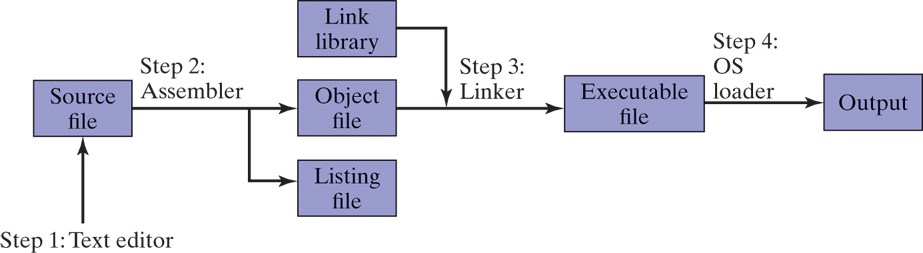
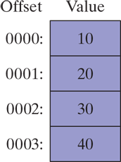
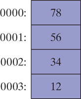
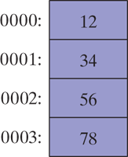

# Assembly Language for x86 Processors


## Chapter 1 - Basic Concepts

#### Page 53

###### What Types of Programs Can Be Created Using MASM?

32-bit protected mode programs run under all 32-bit and 64-bit versions of Microsoft Windows. They are usually easier to write and understand than real-mode programs.

#### Page 54-56

###### How Does Assembly Language Relate to Machine Language?

***Machine language*** is a numeric language specifically understood by a computer's processor. All x86 processors understand a common machine language. Assembly language consists of statements written with short mnemonics such as `ADD`, `MOV`, `SUB`, and `CALL`. Assembly language has a one-to-one relationship with machine language: Each assembly language instruction corresponds to a single machine- language instruction.

###### How Do C++ and Java Relate to Assembly Language?

High-level languages have a one-to-many relationship with assembly language and machine language. This means that a single statement in C++, for example, expands into multiple assembly language or machine instructions. The following C++ code carries out two arithmetic operations and assigns the result to a variable. Assume `X` and `Y` are integers:

```cpp
int Y;
int X = (Y + 4) * 3;
```

Following is the equivalent translation to assembly language. The translation requires multiple statements because each assembly language statement corresponds to a single machine instruction:

```assembly
mov  eax, Y    ; move Y to the EAX register
add  eax, 4    ; add 4 to the EAX register
mov  ebx, 3    ; move 3 to the EBX register
imul ebx       ; multiply EAX by EBX
mov  X, eax    ; move EAX to X 
```

***Registers*** are named storage locations in the CPU that hold intermediate results of operations.

#### Page 67

###### Specific Machines

A computer's digital logic hardware represents machine Level 1. Above this is Level 2, called the ***instruction set Architecture (ISA)***. This is the first level at which users can typically write programs, although the programs consist of binary values called ***machine language***.


#### Page 67-68

###### Instruction Set Architecture (Level 2)

Computer chip manufacturers design into the processor an instruction set to carry out basic operations, such as move, add, or multiply. This set of instructions is also referred to as machine language. Each machine- language instruction is executed either directly by the computer's hardware or by a program embedded in the microprocessor chip called a ***microprogram***.

#### Page 68

###### Assembly Language (Level 3)

Above the ISA level, programming languages provide translation layers to make large-scale software development practical. Assembly language, uses short mnemonics such as `ADD`, `SUB`, and `MOV`, which are easily translated to the ISA level. Assembly language programs are translated (assembled) in their entirety into machine language before they begin to execute.

#### Page 73

###### Binary Integers

A computer stores instructions and data in memory as collections of electronic charges. Representing these entities with numbers requires a system geared to the concepts of on and off. Binary numbers are base `2` numbers in which each binary digit (called a bit) is either `0` or `1`. Bits are numbered sequentially starting at zero on the right side and increasing toward the left. The bit on the left is called the ***most significant bit (MSB)***, and the bit on the right is the ***least significant bit (LSB)***. The MSB and LSB bit numbers of a 16-bit binary number are shown in the following figure:


#### Page 79

###### Integer Storage Sizes

The basic storage unit for all data in an x86 computer is a byte, containing 8 bits. Other storage sizes are ***word*** (2 bytes), ***doubleword*** (4 bytes), and ***quadword*** (8 bytes).


#### Page 83-84

###### Converting Unsigned Hexadecimal to Decimal

Suppose we number the digits in a four-digit hexadecimal integer with subscripts as $D_3D_2D_1D_0$. The following formula calculates the integer's decimal value:

$$
dec = (D_3 * 16^3) + (D_2 * 16^2) + (D_1 * 16^1) + (D_0 * 16^0)
$$

For example, hexadecimal `3BA4` is equal to $(3 * 16^3) + (11 * 16^2) + (10 * 16^1) + (4 * 16^0)$, or decimal `15,268`.


#### Page 85-86

###### Converting Unsigned Decimal to Hexadecimal

To convert an unsigned decimal integer to hexadecimal, repeatedly divide the decimal value by `16` and retain each remainder as a hexadecimal digit. For example, to convert `422` to hexadecimal:

```
422 / 16 = 26 (remainder 6)
26 / 16 = 1 (remainder A)
1 / 16 = 0 (remainder 1)
```

The resulting hexadecimal number is assembled from the digits in the remainder column, starting from the last row and working upward to the top row. In our case `1A6`.

#### Page 86

###### Hexadecimal Addition

Let's demonstrate this by adding `6A2` and `49A`. We start from right to left adding `2` to `A` (`2` and `10` in decimal), which is `C` (`12` in decimal). Then `A` and `9` (`10` and `9`), the result is `F3` (`19` in decimal), but since `19` is larger than our base number `16` we take the `3` and carry `1`. Finally we add `6`, `4`, and the `1` we are carrying, which is equal to `B` (`11` in decimal)

```
  6A2
+ 49A
-----
  B3C
```

The decimal counterparts of these numbers are `1698`, `1178`, and `2876` respectively.

#### Page 87

###### Signed Binary Integers

***Signed binary integers*** are positive or negative. For x86 processors, the MSB indicates the sign: `0` is positive and `1` is negative.


#### Page 87-88

###### Two's-Complement Representation

Negative integers use two's-complement representation, using the mathematical principle that the two's complement of an integer is its additive inverse. (If you add a number to its additive inverse, the sum is zero.)

The two's complement of a binary integer is formed by inverting its bits and adding `1`. Using the 8-bit binary value `00000001`, for example, its two's complement turns out to be `11111111`.

| Starting value                         | 00000001                          |
| -------------------------------------- | --------------------------------- |
| Step 1: Reverse the bits               | 11111110                          |
| Step 2: Add 1 to the value from Step 1 | &nbsp;&nbsp;11111110<br>+00000001 |
| Sum: Two's-complement representation   | 11111111                          |

#### Page 88-89

###### Hexadecimal Two's-Complement

To create the two's complement of a hexadecimal integer, reverse all bits and add `1`. An easy way to reverse the bits of a hexadecimal digit is to subtract the digit from `15`.

```
6A3D --> 95C2 + 1 --> 95C3
95C3 --> 6A3C + 1 --> 6A3D
```

#### Page 89-90

###### Converting Signed Binary to Decimal

To convert a signed binary we have to consider the value of its MSB:

- If the highest bit is a `1`, the number is stored in two's-complement notation. Create its two's complement a second time to get its positive equivalent. Then convert this new number to decimal as if it were an unsigned binary integer.
- If the highest bit is a `0`, you can convert it to decimal as if it were an unsigned binary integer.

Taking `11110000` as an example, these are the steps we would take to convert it to decimal:

| Starting value                         | 11110000                          |
| -------------------------------------- | --------------------------------- |
| Step 1: Reverse the bits               | 00001111                          |
| Step 2: Add 1 to the value from Step 1 | &nbsp;&nbsp;00001111<br>+00000001 |
| Step 3: Create the two's component     | 00010000                          |
| Step 4: Convert to decimal             | 16                                |

Because the original integer was negative, we know that its decimal value is `-16`.

#### Page 91

###### Converting Signed Hexadecimal to Decimal

- If the hexadecimal integer is negative, create its two's complement; otherwise, retain the integer as is.
- Using the integer from the previous step, convert it to decimal. If the original value was negative, attach a minus sign to the beginning of the decimal integer.

You can tell whether a signed hexadecimal integer is positive or negative by inspecting its most significant (highest) digit. If the digit is `>= 8`, the number is negative. For example, `8A20` is negative and `7FD9` is positive.

#### Page 92-94

###### Binary Subtraction

When subtracting binary numbers we have have to remember the rules as seen in the following table:

| - | 0 | 1 |
| - | - | - |
| 0 | 0 | 1 |
| 1 | 1 | 0 |

As we can see `0 - 0 = 0`, `1 - 0 = 1`, and `1 - 1 = 0`, but for `0 - 1` we have to borrow `1` from the digit to the left, making it `10 - 1 = 1`. For example:

```
  01101
- 00111
-------
  00110
```

This subtract `7` from `13`, and the result is effectively `6`.

Another approach to binary subtraction is to reverse the sign of the value being subtracted, and then add the two values. This method requires you to have an extra empty bit to hold the number's sign. Using this method first, we negate `00111` by inverting its bits (`11000`) and adding `1`, producing `11001`. Next, we add the binary values and ignore the carry out of the highest bit:

```
  01101
- 11001
-------
  00110
```

#### Page 95-96

###### Unicode Standard

The ***Unicode*** was created as a universal way of defining characters and symbols. It defines numeric codes (called ***code points***) for characters, symbols, and punctuation used in all major languages, as well as European alphabetic scripts, Middle Eastern right-to-left scripts, and many scripts of Asia. Three transformation formats are used to transform code points into displayable characters called ***Unicode Transformation Format (UTF)***:

- ***UTF-8*** used in HTML, and has the same byte values as ASCII.
- ***UTF-16*** used in environments that balance efficient access to characters with economical use of storage. Recent versions of Microsoft Windows, for example, use UTF-16. Each character is encoded in 16 bits.
- ***UTF-32*** used in environments where space is no concern and fixed-width characters are required. Each character is encoded in 32 bits.

#### Page 97-98

###### ASCII Control Characters

Character codes in the range `0` through `31` are called ***ASCII control characters***. If a program writes these codes to standard output, the control characters will carry out predefined actions.

| ASCII Code<br>(Decimal) | Description                                       |
| ----------------------- | ------------------------------------------------- |
| 8                       | Backspace (moves one column to the left)          |
| 9                       | Horizontal tab (skips forward *n* columns)        |
| 10                      | Line feed (moves to next output line)             |
| 12                      | Form feed (moves to next printer page)            |
| 13                      | Carriage return (moves to leftmost output column) |
| 27                      | Escape character                                  |

#### Page 99-100

###### Binary-Coded Decimal (BCD) Numbers

Decimal values can be stored in two general representations, commonly known as ***packed BCD*** and ***unpacked BCD***. These representations rely on the fact that a decimal digit can be represented by a maximum of `4` binary bits, from `0000` to `1001`.

###### Unpacked BCD

In *unpacked BCD*, one decimal digit is encoded in each binary byte. For example, `1,234,567` can be stored as an array of bytes: `01`, `02`, `03`, `04`, `05`, `06`, `07`, shown here in hexadecimal format. If the high-order digit occurs first in the sequence, we call that ***big-endian*** order (the opposite is called ***little-endian*** order). Numbers in *unpacked BCD* format can be of any arbitrary length and can be easily translated into displayable ASCII characters (by adding `30h`) to each byte. For example, if you add `30h` to the *unpacked BCD* value `07`, the result (`37h`) is the ASCII encoding of the displayable character `7`.

###### Packed BCD

In packed BCD format, two decimal digits are encoded in each binary byte. For example, the value `1,234,567` can be stored as the array of bytes (shown here in hexadecimal) as `01`, `23`, `45`, `67`. Because there are an odd number of digits, the upper `4` bits of the first byte can be all zeros, or they can be used to represent the number's sign.

#### Page 104-110

###### Boolean Expressions

A ***Boolean expression*** involves a Boolean operator and one or more operands. Each *Boolean expression* implies a value of true or false. The set of operators includes the following:

- `NOT`: notated as `¬` or `~` or `'`
- `AND`: notated as `∧` or `•`
- `OR`: notated as `∨` or `+`

The `NOT` operator is unary, and the other operators are binary. The operands of a *Boolean expression* can also be Boolean expressions.

The `AND` operation is often carried out at the bit level in assembly language. In the following example, each bit in `X` is `AND`ed with its corresponding bit in `Y`:


The `OR` operation is often carried out at the bit level. In the following example, each bit in `X` is `OR`ed with its corresponding bit in `Y:


***Operator precedence*** rules are used to indicate which operators execute first in expressions involving multiple operators. In a *Boolean expression* involving more than one operator, precedence is important. The `NOT` operator has the highest precedence, followed by `AND` and `OR`. You can use parentheses to force the initial evaluation of an expression.

## Chapter 2 - x86 Processor Architecture

#### Page 130-132

###### Basic Microcomputer Design

***The central processor unit (CPU)***, where calculations and logical operations take place, contains a limited number of storage locations named ***registers*** , a high-frequency clock, a control unit, and an arithmetic logic unit.


- The ***clock*** synchronizes the internal operations of the CPU with other system components.
- The ***control unit (CU)*** coordinates the sequencing of steps involved in executing machine instructions.
- The ***arithmetic logic unit (ALU)*** performs arithmetic operations such as addition and subtraction and logical operations such as `AND`, `OR`, and `NOT`.

Most CPU pins connect to the data bus, the control bus, and the address bus. The ***memory storage unit*** is where instructions and data are held while a program is running. The storage unit receives requests for data from the CPU, transfers data from ***random access memory (RAM)***, and transfers data from the CPU into memory. All processing of data takes place within the CPU, so programs residing in memory must be copied into the CPU before they can execute. Individual program instructions can be copied into the CPU one at a time, or groups of instructions can be copied together.

A ***bus*** is a parallel transfer path that moves data from one part of a computer to another. A computer system usually contains four bus types: data, input/output (I/O), control, and address. The ***data bus*** transfers instructions and data between the CPU and memory. The I/O bus transfers data between the CPU and the system I/O devices. The ***control bus*** uses binary signals to synchronize actions of all devices attached to the system bus. The ***address bus*** holds the addresses of instructions and data when the currently executing instruction transfers data between the CPU and memory.

#### Page 132-133

###### Clock

Each operation involving the CPU and the system bus is synchronized by an internal clock pulsing at a constant rate. The basic unit of time for machine instructions is a ***machine cycle*** (or ***clock cycle***). The length of a clock cycle is the time required for one complete clock pulse.


The duration of a clock cycle is calculated as the reciprocal of the clock's speed, which in turn is measured in oscillations per second. A clock that oscillates 1 billion times per second (1 GHz), for example, produces a clock cycle with a duration of one billionth of a second (1 nanosecond).

A machine instruction requires at least one clock cycle to execute. Instructions requiring memory access often have empty clock cycles called ***wait states*** because of the differences in the speeds of the CPU, the system bus, and memory circuits.

#### Page 133-135

###### Instruction Execution Cycle

1. First, the CPU has to **fetch the instruction** from an area of memory called the ***instruction queue***. Right after doing this, it increments the instruction pointer.
2. Next, the CPU **decodes** the instruction by looking at its binary bit patter. This bit pattern might reveal that the instruction has operands (input values).
3. If operands are involved, the CPU **fetches the operands** from registers and memory. Sometimes, this involves address calculations.
4. Next, the CPU **executes** the instruction, using any operand values it fetched during the earlier step. It also updates a few status flags, such as *Zero*, *Carry*, and *Overflow*.
5. Finally, if an output operand was part of the instruction, the CPU **stores the result** of its execution in the operand.

The three basic steps of this process are ***Fetch***, ***Decode***, and ***Execute***.

In order to read program instructions from memory, an address is placed on the address bus. Next, the memory controller places the requested code on the data bus, making the code available inside the ***code cache***. The instruction pointer's value determines which instruction will be executed next. The instruction is analyzed by the ***instruction decoder***, causing the appropriate digital signals to be sent to the control unit, which coordinates the ALU and floating-point unit. Although the control bus is not shown in the next figure, it carries signals that use the system clock to coordinate the transfer of data between the different CPU components.


#### Page 135-137

###### Reading from Memory

Computers read memory much more slowly than they access internal registers. This is because reading a single value from memory involves four separate steps:

1. Place the address of the value you want to read on the address bus.
2. Assert (change the value of) the processor's RD (read) pin.
3. Wait one clock cycle for the memory chips to respond.
4. Copy the data from the data bus into the destination operand.

Each of these steps requires a single ***clock cycle***. Computer CPUs are often described in terms of their clock speeds. A speed of 1.2 GHz, for example, means the clock ticks, or oscillates, 1.2 billion times per second. So, 4 clock cycles go by fairly fast, considering each one lasts for only 1/1,200,000,000th of a second. Still, that's much slower than the CPU registers, which are usually accessed in only one clock cycle.

Computer memory creates a speed bottleneck because most programs have to access variables. That's why they store the most recently used instructions and data in high-speed memory called ***cache***. The idea is that a program is more likely to want to access the same memory and instructions repeatedly, so cache keeps these values where they can be accessed quickly. Also, when the CPU begins to execute a program, it can look ahead and load the next thousand instructions (to say a number) into cache, on the assumption that these instructions will be needed fairly soon. If there happens to be a loop in that block of code, the same instructions will be in cache. When the processor is able to find its data in cache memory, we call that a *cache hit*. If it tries to find something and it's not there, we call that a *cache miss*.

Cache memory for the x86 family comes in two types. ***Level-1 cache*** (or *primary cache*) is stored right on the CPU. ***Level-2 cache*** (or secondary cache) is a little bit slower, and attached to the CPU by a high-speed data bus.

Cache memory is constructed from a special type of memory chip called ***static RAM*** which does not have to be constantly refreshed, unlike conventional memor (***dynamic RAM***).

#### Page 137-138

###### Loading and Executing a Program

Before a program can run, it must be loaded into memory by a utility known as a ***program loader***. After loading, the operating system must point the CPU to the ***program's entry point***, which is the address at which the program is to begin execution. The following steps break this process down in more detail:

- The OS searches for the program's filename in the current disk directory. If it cannot find the name there, it searches a predetermined list of directories (*paths*) for the filename. If the OS fails to find the program filename, it issues an error message.
- If the program file is found, the OS retrieves basic information about the program's file from the disk directory, including the file size and its physical location on the disk drive.
- The OS determines the next available location in memory and loads the program file into memory. It allocates a block of memory to the program and enters information about the program's size and location into a table (sometimes called a descriptor table). The OS may also adjust the values of pointers within the program so they contain addresses of program data.
- The OS begins execution of the program's first machine instruction (its entry point). As soon as the program begins running, it is called a ***process***. The OS assigns the process an identification number (***process ID***), which is used to keep track of it while running.
- The process runs by itself. It is the OS's job to track the execution of the process and to respond to requests for system resources (memory, disk files, I/O devices, etc.).
- When the process ends, it is removed from memory.

#### Page 142-143

###### 32-Bit x86 Processors

x86 processors have three primary modes of operation: protected mode, real-address mode, and system management mode. A sub-mode, named ***virtual-8086***, is a special case of protected mode.

###### Protected Mode

Is the native state of the processor, in which all instructions and features are available. Programs are given separate memory areas named *segments*, and the processor prevents programs from referencing memory outside their assigned segments.

###### Virtual-8086 Mode

While in protected mode, the processor can safely execute real-address mode software such as MS-DOS programs in a sandbox-like environment named *virtual-8086* mode. In other words, if a program crashes or attempts to write data into the system memory area, it will not affect other programs running at the same time. A modern operating system can execute multiple separate virtual-8086 sessions at the same time.

###### Real-Address Mode

*Real-address mode* implements the programming environment of an early Intel processor with a few extra features, such as the ability to switch into other modes. This mode is useful if a program requires direct access to system memory and hardware devices. Current versions of the Windows operating system do not support Real-Address mode.

###### System Management Mode

*System management mode (SMM)* provides its host operating system with a mechanism for implementing functions such as power management and system security. These functions are usually implemented by computer manufacturers who customize the processor for a particular system setup.

#### Page 143-150

###### Basic Execution Environment

###### Address Space

In a 32-bit processor running in protected mode, a task or program can address a linear address space of up to 4 GBytes. Beginning with the P6 processor, a technique called ***extended physical addressing*** allows a total of 64 GBytes of physical memory to be addressed. Real-address mode programs, on the other hand, can only address a range of 1 MByte. If the processor is in protected mode and running multiple programs in virtual- 8086 mode, each program has its own 1-MByte memory area.

###### Basic Program Execution Registers

When a processing loop is optimized for speed, for example, loop counters are held in registers rather than variables. There are eight general-purpose registers, six segment registers, a processor status flags register (EFLAGS), and an instruction pointer (EIP).


###### General-Purpose Registers

The *general-purpose registers* are primarily used for arithmetic and data movement.


Portions of some registers can be addressed as 8-bit values. For example, the `AX` register has an 8-bit upper half named `AH` and an 8-bit lower half named `AL`. The same overlapping relationship exists for the `EAX`, `EBX`, `ECX`, and `EDX` registers:

| 32-Bit | 16-Bit | 8-Bit (High) | 8-Bit (Low) |
| ------ | ------ | ------------ | ----------- |
| EAX    | AX     | AH           | AL          |
| EBX    | BX     | BH           | BL          |
| ECX    | CX     | CH           | CL          |
| EDX    | DX     | DH           | DL          |

The remaining general-purpose registers can only be accessed using 32-bit or 16-bit names, as shown in the following table:

| 32-Bit | 16-Bit |
| ------ | ------ |
| ESI    | SI     |
| EDI    | DI     |
| EBP    | BP     |
| ESP    | SP     |

###### Specialized Uses

Some general-purpose registers have specialized uses:

- `EAX` is automatically used by multiplication and division instructions. It is often called the *extended accumulator* register.
- The CPU automatically uses `ECX` as loop counter.
- `ESP` addresses data on the stack (a system memory structure). It is rarely used for ordinary arithmetic or data transfer. It is often called the *extended stack pointer* register.
- `ESI` and `EDI` are used by high-speed memory transfer instructions. They are sometimes called the *extended source index* and *extended destination index* registers.
- `EBP`is used by high-level languages to reference function parameters and local variables on the stack. It should not be used for ordinary arithmetic or data transfer except at an advanced level of programming. It is often called the *extended frame pointer* register.

###### Segment Registers

In x86 protected mode, ***segment registers*** hold pointers to segment descriptor tables. Some segments hold program instructions (code), others hold variables (data), and another segment named the *stack segment* holds local function variables and function parameters.

###### Instruction Pointer

The `EIP`, or ***instruction pointer***, register contains the address of the next instruction to be executed. Certain machine instructions manipulate `EIP`, causing the program to branch to a new locatio.

###### EFLAGS Register

The ***EFLAGS*** (or just ***Flags***) register consists of individual binary bits that control the operation of the CPU or reflect the outcome of some CPU operation. Some instructions test and manipulate individual processor flags.

A flag is set when it equals 1; it is clear (or reset) when it equals 0.

###### Control Flags

***Control flags*** control the CPU's operation. For example, they can cause the CPU to break after every instruction executes, interrupt when arithmetic overflow is detected, enter virtual-8086 mode, and enter protected mode.

Programs can set individual bits in the EFLAGS register to control the CPU's operation. Examples are the *Direction* and *Interrupt* flags.

###### Status Flags

The **status flags** reflect the outcomes of arithmetic and logical operations performed by the CPU. They are the *Overflow*, *Sign*, *Zero*, *Auxiliary Carry*, *Parity*, and *Carry* flags.

- The ***Carry flag (CF)*** is set when the result of an *unsigned* arithmetic operation is too large to fit into the destination.
- The ***Overflow flag (OF)*** is set when the result of a *signed* arithmetic operation is too large or too small to fit into the destination.
- The ***Sign flag (SF)*** is set when an arithmetic or logical operation generates a negative result.
- The ***Zero flag (ZF)*** is set when an arithmetic or logical operation generates a result of zero.
- The ***Auxiliary Carry flag (AC)*** is set when an arithmetic operation causes a carry from bit `3` to `4` in an 8-bit operand.
- The ***Parity flag (PF)*** is set if the least-significat byte in the result contains an even number of `1` bits. Otherwise, *PF* is clear. In general, it is used for error checking when there is a possibility that data might be altered or corrupted.

###### MMX Registers

MMX technology improves the performance of Intel processors when implementing advanced multimedia and communications applications. The eight 64-bit ***MMX registers*** support special instructions called SIMD (***Single-Instruction, Multiple-Data***). As the name implies, MMX instructions operate in parallel on the data values contained in MMX registers. Although they appear to be separate registers, the MMX register names are in fact aliases to the same registers used by the floating-point unit.

###### XMM Registers

The x86 architecture also contains eight 128-bit registers called ***XMM registers***. They are used by streaming SIMD extensions to the instruction set.

###### Floating-Point Unit

The ***floating-point unit*** (FPU) performs high-speed floating-point arithmetic. At one time a separate coprocessor chip was required for this. From the Intel486 onward, the FPU has been integrated into the main processor chip. There are eight floating-point data registers in the FPU, named `ST(0)`, `ST(1)`, `ST(2)`, `ST(3)`, `ST(4)`, `ST(5)`, `ST(6)`, and `ST(7)`.


#### Page 150-151

###### x86 Memory Management

In *real-address mode*, only 1 MByte of memory can be addressed, from hexadecimal `00000` to `FFFFF`. The processor can run only one program at a time, but it can momentarily interrupt that program to process requests (called interrupts) from peripherals. Application programs are permitted to access any memory location, including addresses that are linked directly to system hardware. The MS-DOS operating system runs in *real-address mode*, and Windows 95 and 98 can be booted into this mode.

In *protected mode*, the processor can run multiple programs at the same time. It assigns each process a total of 4 GByte of memory. Each program can be assigned its own reserved memory area, and programs are prevented from accidentally accessing each other's code and data. MS-Windows and Linux run in *protected mode*.

In *virtual-8086 mode*, the computer runs in protected mode and creates a virtual-8086 machine with its own 1-MByte address space that simulates an 80x86 computer running in real-address mode. Windows NT and 2000, for example, create a virtual-8086 machine when you open a Command window. You can run many such windows at the same time, and each is protected from the actions of the others. Some MS-DOS programs that make direct references to computer hardware will not run in this mode under most versions of the Windows OS.

#### Page 155-156

###### 64-Bit x86-64 Processors

This group the Intel 64 and AMD64 processor families. The instruction set is a 64-bit extension of the x86 instruction set we've already looked at. Here are some of the essential features:

1. It is backward-compatible with the x86 instruction set.
2. Addresses are `64` bits long, allowing for a virtual address space of size $2^{64}$ bytes. In current chip implementations, only the lowest `48` bits are used.
3. It can use 64-bit general-purpose registers, allowing instructions to have 64-bit integer operands.
4. It uses eight more general-purpose registers than the x86.
5. It uses a 48-bit physical address space, which supports up to 256 terabytes of RAM.

On the other hand, when running in native 64-bit mode, these processors do not support 16-bit real mode or virtual-8086 mode. (There is a legacy mode that still supports 16-bit programming, but it is not available in 64- bit versions of Microsoft Windows.)

#### Page 156-157

###### 64-Bit Operation Modes

The Intel 64 architecture introduces a new mode named ***IA-32e***. Technically it contains two submodes, named *compatibility mode* and ***64- bit mode***. But it's easier to refer to these as modes rather than submodes.

###### Compatibility Mode

When running in *compatibility mode* (also known as *32-bit mode*), existing 16-bit and 32-bit applications can usually run without being recompiled. However, 16-bit Windows (Win16) and DOS applications will not run in 64-bit Microsoft Windows. Unlike earlier versions of Windows, 64-bit Windows does not have a virtual DOS machine subsystem to take advantage of the processor's ability to switch into virtual-8086 mode.

###### 64-Bit Mode

In *64-bit mode*, the processor runs applications that use the 64-bit linear address space. This is the native mode for 64-bit Microsoft Windows. This mode enables 64-bit instruction operands.

#### Page 157-159

###### Basic 64-Bit Execution Environment

In 64-bit mode, addresses can theoretically be as large as 64-bits, although processors currently only support 48 bits for addresses. In terms of registers, the following are the most important differences from 32-bit processors:

- Sixteen 64-bit general purpose registers (in 32-bit mode, you have only eight general-purpose registers)
- Eight 80-bit floating-point registers
- A 64-bit status flags register named `RFLAGS` (only the lower 32 bits are used)
- A 64-bit instruction pointer named `RIP`

###### General-Purpose Registers

In 64-bit mode, the default operand size is `32` bits and there are eight general-purpose registers. By adding the `REX` (register extension) prefix to each instruction, however, the operands can be `64` bits long and a total of `16` general-purpose registers become available. You have all the same registers as in 32-bit mode, plus eight numbered registers, `R8` through `R15`.

| Operand Size | Available Registers                                                                  |
| ------------ | ------------------------------------------------------------------------------------ |
| 8 bits       | AL, BL, CL, DL, DIL, SIL, BPL, SPL, R8L, R9L, R10L, R11L, R12L, R13L, R14L, R15L     |
| 16 bits      | AX, BX, CX, DX, DI, SI, BP, SP, R8W, R9W, R10W, R11W, R12W, R13W, R14W, R15W         |
| 32 bits      | EAX, EBX, ECX, EDX, EDI, ESI, EBP, ESP, R8D, R9D, R10D, R11D, R12D, R13D, R14D, R15D |
| 64 bits      | RAX, RBX, RCX, RDX, RDI, RSI, RBP, RSP, R8, R9, R10, R11, R12, R13, R14, R15         |

- In 64-bit mode, a single instruction cannot access both a high-byte register, such as `AH`, `BH`, `CH`, and `DH`, and at the same time, the low byte of one of the new byte registers (such as `DIL`).
- The 32-bit `EFLAGS` register is replaced by a 64-bit `RFLAGS` register in 64-bit mode. The two registers share the same lower `32` bits, and the upper `32` bits of `RFLAGS` are not used.
- The status flags are the same in 32-bit mode and 64-bit mode.

#### Page 163-166

###### Components of a Typical x86 Computer

###### Motherboard

The heart of a microcomputer is its *motherboard*, a flat circuit board onto which are placed the computer's CPU, supporting processors (chipset), main memory, I/O connectors, power supply connectors, and expansion slots. The various components are connected to each other by a *bus*, a set of wires etched directly on the motherboard. The following components have traditionally been found on PC motherboards:

- A CPU socket
- Memory slots (SIMM or DIMM)
- ***BIOS (basic input-output system)*** computer chips, holding system software
- CMOS RAM, with a small battery to keep it powered
- Connectors for mass-storage devices such as hard drives and CD-ROMs
- USB connectors for external devices
- Keyboard and mouse ports
- PCI bus connectors for sound cards, graphics cards, data adquisition boards, and other I/O devices

The following components are optional:

- Integrated sound processor
- Parallel and serail device connectors
- Integrated network adapter
- AGP bus connector for a high-speed video card

Following are some important support processors in a typical legacy system:

- The ***Floating-Point Unit*** (FPU) handles floating-point and extended integer calculations.
- The 8284/82C284 *Clock Generator*, known simply as the clock, oscillates at a constant speed. The clock generator synchronizes the CPU and the rest of the computer.
- The 8259A ***Programmable Interrupt Controller (PIC)*** interface handles external interrupts from hardware devices, such as the keyboard, system clock, and disk drives. These devices interrupt the CPU and make it process their requests immediately.
- The 8253 ***Programmable Interval Timer/Counter*** interrupts the system 18.2 times per second, updates the system date and clock, and controls the speaker. It is also responsible for constantly refreshing memory because RAM memory chips can remember their data for only a few milliseconds.
- The ***Universal Serial Bus (USB) controller*** transfers data to and from devices connected to USB ports.

###### PCI and PCI Express Bus Architectures

The *PCI (Peripheral Component Interconnect)* bus provides a connecting bridge between the CPU and other system devices such as hard drives, memory, video controllers, sound cards, and network controllers. The *PCI Express* bus provides two-way serial connections between devices, memory, and the processor. It carries data in packets, similar to networks, in separate "lanes". It has been widely supported by graphics controllers, and has been used for many years to transfer data at high speed.

###### Motherboard Chipset

Is a collection of processor chips designed to work together on a specific type of motherboard. Various chipsets have implemented features that increase processing power, multimedia capabilities, or reduce power consumption. The *Intel P965 Express Chipset* can be used as an example. It has been used in desktop PCs for many years, with Intel Core 2 Duo and Pentium D processors. Here are some of its features:

- Intel *Fast Memory Access* uses an updated Memory Controller Hub (MCH). It can access dual-channel DDR2 memory, at an 800-MHz clock speed.
- An I/O Controller Hub (Intel ICH8/R/DH) uses Intel Matrix Storage Technology (MST) to support multiple Serial ATA devices (disk drives).
- Support for multiple USB ports, multiple PCI express slots, networking, and Intel Quiet System technology.
- A high definition audio chip provides digital sound capabilities.


#### Page 166-167

###### Memory

Several basic types of memory have been used in Intel-based systems for many years: ***read-only memory (ROM)***, erasable programmable read-only memory (EPROM), dynamic random-access memory (DRAM), ***static RAM*** (SRAM), video RAM (VRAM), and complementary metal oxide semiconductor (CMOS) RAM:

- ***ROM*** is permanently burned into a chip and cannot be erased.
- ***EPROM*** can be erased slowly with ultraviolet light and reprogrammed.
- ***DRAM***, commonly known as main memory, is where programs and data are kept when a program is running. It is inexpensive, but must be refreshed every millisecond to avoid losing its contents. Some systems use ECC (error checking and correcting) memory.
- ***SRAM*** is used primarily for expensive, high-speed cache memory. It does not have to be refreshed. CPU cache memory uses SRAM.
- ***VRAM*** holds video data. It is dual ported, allowing one port to continuously refresh the display while another port writes data to the display.
- ***CMOS RAM*** on the system motherboard stores system setup information. It is refreshed by a battery, so its contents are retained when the computer's power is off.

#### Page 171-175

###### Input–Output System

###### Levels of I/O Access

Application programs routinely read input from keyboard and disk files and write output to the screen and to files. I/O need not be accomplished by directly accessing hardware—instead, you can call functions provided by the operating system. There are three primary levels:

- **High-level language functions**: A high-level programming language contain functions to perform I/O. These functions are portable because they work on a variety of different computer systems and are not dependent on any one operating system.
- **Operating system**: Operating system functions can be called from a library known as the operating system API. The operating system provides high-level operations such as writing strings to files, reading strings from the keyboard, and allocating blocks of memory.
- **BIOS**: The basic input–output system is a collection of low-level subroutines that communicate directly with hardware devices. The BIOS is installed by the computer's manufacturer and is tailored to fit the computer's hardware. Operating systems typically communicate with the BIOS.

###### Device Drivers

***Device drivers*** are programs that permit the operating system to communicate directly with hardware devices and the system BIOS. For example, a device driver might receive a request from the OS to read some data; the device driver satisfies the request by executing code in the device firmware that reads data in a way that is unique to the device. Device drivers are usually installed in one of two ways: (1) before a specific hardware device is attached to a computer, or (2) after a device has been attached and identified. In the latter case, the OS recognizes the device name and signature; it then locates and installs the device driver software onto the computer.

For example this is what happens when an application program displays a string of characters on the screen:

1. A statement in the application program calls an HLL library function that writes the string to standard output.
2. The library function (Level 3) calls an operating system function, passing a string pointer.
3. The operating system function (Level 2) uses a loop to call a BIOS subroutine, passing it the ASCII code and color of each character. The operating system calls another BIOS subroutine to advance the cursor to the next position on the screen.
4. The BIOS subroutine (Level 1) receives a character, maps it to a particular system font, and sends the character to a hardware port attached to the video controller card.
5. The video controller card (Level 0) generates timed hardware signals to the video display that control the raster scanning and displaying of pixels.


###### Programming at Multiple Levels

Assembly language can choose from the following access levels:

- Level 3: Call library functions to perform generic text I/O and file- based I/O.
- Level 2: Call operating system functions to perform generic text I/O and file-based I/O. If the OS uses a graphical user interface, it has functions to display graphics in a device-independent way.
- Level 1: Call BIOS functions to control device-specific features such as color, graphics, sound, keyboard input, and low-level disk I/O.
- Level 0: Send and receive data from hardware ports, having absolute control over specific devices. This approach cannot be used with a wide variety of hardware devices, so we say that it is not portable. Different devices often use different hardware ports, so the program code must be customized for each specific type of device.


Level 2 works on any computer running the same OS. If an I/O device lacks certain capabilities, the OS will do its best to approximate the intended result. Level 2 is not particularly fast because each I/O call must go through several layers before it executes.

Level 1 works on all systems having a standard BIOS, but will not produce the same result on all systems. For example, two computers might have video displays with different resolution capabilities. A programmer at Level 1 would have to write code to detect the user's hardware setup and adjust the output format to match. Level 1 runs faster than Level 2 because it is only one level above the hardware.

Level 0 works with generic devices such as serial ports and with specific I/O devices produced by known manufacturers. Programs using this level must extend their coding logic to handle variations in I/O devices. Real-mode game programs are prime examples because they usually take control of the computer. Programs at this level execute as quickly as the hardware will permit.

## Chapter 3 - Assembly Language Fundamentals

#### Page 191-192

###### First Assembly Language Program

```assembly
main PROC
  mov eax, 5              ; move 5 to the eax register
  add eax, 6              ; add 6 to the eax register

  INVOKE ExitProcess, 0   ; end the program
main ENDP
```

Line 1 starts the main procedure, the entry point for the program. Line 2 places the integer `5` in the `eax` register. Line 3 adds `6` to the value in `eax`, giving it a new value of `11`. Line 5 calls a Windows service (also known as a function) named **ExitProcess** that halts the program and returns control to the operating system. Line `6` is the ending marker of the main procedure.

#### Page 192-194

###### Adding a Variable

```assembly
.data                       ; this is the data area
  sum DWORD 0               ; create a variable named sum

.code                       ; this is the code area 
  main PROC
    mov eax, 5              ; move 5 to the eax
    add eax, 6              ; add 6 to the eax register
    mov sum, eax

    INVOKE ExitProcess, 0   ; end the program
  main ENDP
```

We give the `sum` variable a size of 32 bits, using the `DWORD` keyword.

The code and data areas marked by the `.code` and `.data` directives, are called ***segments***. A segment is a designated storage area that holds either program code, program variables, or the stack.

#### Page 194-195

###### Integer Literals

An ***integer literal*** (or ***integer constant***) is made up of an optional leading sign, one or more digits, and an optional radix character that indicates the number's base:

```
[{+ | − }] digits [ radix ]
```

Elements within square brackets `[..]` are optional and elements within braces `{..}` require a choice of one of the enclosed elements, separated by the `|` character.

So, for example, `26` is a valid integer literal. It doesn't have a radix, so we assume it's in decimal format. If we wanted it to be `26` hexadecimal, we would have to write it as `26h`. Similarly, the number `1101` would be considered a decimal value until we added a "b" at the end to make it `1101b`. Here are the possible radix values:

| Suffix | Number format       |
| ------ | ------------------- |
| h      | hexadecimal         |
| q/o    | octal               |
| d      | decimal             |
| b      | binary              |
| r      | encoded real        |
| t      | decimal (alternate) |
| y      | binary (alternate)  |

```assembly
26          ; decimal
26d         ; decimal
11010011b   ; binary
42q         ; octal
42o         ; octal
1Ah         ; hexadecimal
0A3h        ; hexadecimal
```

A hexadecimal literal beginning with a letter must have a leading zero to prevent the assembler from interpreting it as an identifier. Such is the case with the hexadecimal value `A3h` in the foregoing list, which must be written as `0A3h`.

#### Page 195-196

###### Constant Integer Expressions

A ***constant integer expression*** is a mathematical expression involving integer literals and arithmetic operators. Each expression must evaluate to an integer, which can be stored in `32` bits (`0` through `FFFFFFFFh`). Constant integer expressions can only be evaluated at assembly time.

| Operator | Name              | Precedence Level |
| -------- | ----------------- | ---------------- |
| ()       | Parentheses       | 1                |
| +,-      | Unary plus, minus | 2                |
| *,/      | Multiply, divide  | 3                |
| MOD      | Modulus           | 3                |
| +,-      | Add, subtract     | 4                |

#### Page 197-199

###### Real Number Literals

***Real number literals*** (or ***floating-point literals***) are represented as either decimal reals or encoded (hexadecimal) reals. A ***decimal real*** contains an optional sign followed by an integer, a decimal point, an optional integer that expresses a fraction, and an optional exponent:

```
[sign]integer.[integer][exponent]
```

These are the formats for the sign and exponent:

```
sign      {+, −}
exponent  E[{+, −}]integer
```

Following are examples of valid decimal reals:

```
2.
+3.0
-44.2E+05
26.E5
```

At least one digit and a decimal point are required.

An ***encoded real*** represents a real number in hexadecimal, using the IEEE floating-point format for short reals. The binary representation of decimal `+1.0`, for example, is:

```
0011 1111 1000 0000 0000 0000 0000 0000
```

The same value would be encoded as a short real in assembly language as:

```
3F800000r
```

#### Page 199

###### Character Literals

A character literal is a single character enclosed in single or double quotes. The assembler stores the value in memory as the character's binary ASCII code. Examples are

```
'A'
"d"
```

#### Page 199-200

###### String Literals

A ***string literal*** is a sequence of characters (including spaces) enclosed in single or double quotes:

```
'ABC'
'X'
"Good night, Gracie"
'4096'
```

String literals are stored in memory as sequences of integer byte values. So, for example, the string literal `"ABCD"` contains the four bytes `41h`, `42h`, `43h`, and `44h`.

#### Page 200-201

###### Reserved Words

A ***reserved word*** is a word in a source code program that has a special meaning determined by the assembly language's syntax. It can only be used in the correct context. Reserved words, by default, are not case-sensitive. For example, `MOV` is the same as `mov` and `Mov`. There are different types of reserved words:

- Instruction mnemonics, such as `MOV`, `ADD`, and `MUL`
- Register names, such as `EAX` and `BX`
- Directives, which tell the assembler how to assemble programs, such as `INVOKE` or `ENDP`
- Attributes, which provide size and usage information for variables and operands. Examples are `BYTE` and `WORD`
- Operators, used in constant expressions
- Predefined symbols that return constant integer values at assembly time

#### Page 201-202

###### Identifiers

An identifier is a programmer-chosen name. It might identify a variable, a constant, a procedure, or a code label. There are a few rules on how identifiers can be formed:

- They may contain between 1 and 247 characters.
- They are not case sensitive.
- The first character must be a letter (`A..Z`, `a..z`), underscore (`_`), `@` , `?`, or `$`. Subsequent characters may also be digits.
- An identifier cannot be the same as an assembler reserved word.

#### Page 202-204

###### Directives

A ***directive*** is a command embedded in the source code that is recognized and acted upon by the assembler. Directives do not execute at runtime, but they let you define variables, macros, and procedures. They can assign names to program segments and perform many other housekeeping tasks related to the assembler. Directives are not, by default, case sensitive. For example, `.data`, `.DATA`, and `.Data` are equivalent.

The following example helps to show the difference between directives and instructions. The `DWORD` directive tells the assembler to reserve space in the program for a doubleword variable. The `MOV` instruction, on the other hand, executes at runtime, copying the contents of `myVar` to the `EAX` register:

```assembly
myVar DWORD 26
mov   eax, myVar
```

Although all assemblers for Intel processors share the same instruction set, they usually have different sets of directives. The Microsoft assembler's `REPT` directive, for example, is not recognized by some other assemblers.

###### Defining Program Segments

One important function of assembler directives is to define program segments. For example, one segment can be used to define variables, and is identified by the `.data` directive. The `.code` directive identifies the area of a program containing executable instructions. The `.stack` directive identifies the area of a program holding the runtime stack.

#### Page 204-211

###### Instructions

An ***instruction*** is a statement that becomes executable when a program is assembled. Instructions are translated by the assembler into machine language bytes, which are loaded and executed by the CPU at runtime. An instruction contains four basic parts:

- Label (optional)
- Instruction mnemonic (required)
- Operand(s) (usually required)
- Comment (optional)

This is how the different parts are arranged:

```
[label:] mnemonic [operands] [;comment]
```

###### Label

A ***label*** is an identifier that acts as a place marker for instructions and data. A label placed just before an instruction implies the instruction's address. Similarly, a label placed just before a variable implies the variable's address. There are two types of labels: *Data labels* and *Code labels*.

A ***data label*** identifies the location of a variable, providing a convenient way to reference the variable in code. The following, for example, defines a variable named count:

```assembly
count DWORD 100
```

The assembler assigns a numeric address to each label. It is possible to define multiple data items following a label. In the following example, array defines the location of the first number (`1024`). The other numbers following in memory immediately afterward:

```assembly
array DWORD 1024, 2048
      DWORD 4096, 8192
```

A label in the code area of a program must end with a colon (`:`) character. Code labels are used as targets of jumping and looping instructions. For example, the following `JMP` instruction transfers control to the location marked by the label named target, creating a loop:

```assembly
target:
  mov ax, bx
  ...
  jmp target
```

###### Instruction Mnemonic

An ***instruction mnemonic*** is a short word that identifies an instruction. Assembly language instruction mnemonics such as `mov`, `add`, and `sub` provide hints about the type of operation they perform. Following are examples of instruction mnemonics:

| Mnemonic | Description                        |
| -------- | ---------------------------------- |
| MOV      | Move (assign) one value to another |
| ADD      | Add two values                     |
| SUB      | Subtract one value from another    |
| MUL      | Multiply two values                |
| JMP      | Jump to a new location             |
| CALL     | Call a procedure                   |

###### Operands

An ***operand*** is a value that is used for input or output for an instruction. Assembly language instructions can have between zero and three operands, each of which can be a register, memory operand, integer expression, or input–output port. A ***memory operand*** is an instruction operand that implicitly references a memory location, using either a register with brackets around it, or by using a variable name. There are different ways to create memory operands—using variable names, registers surrounded by brackets, for example. A variable name implies the address of the variable and instructs the computer to reference the contents of memory at the given address.

The `STC` instruction, for example, has no operands. The `INC` instruction has one operand. The `MOV` instruction has two operands. The `IMUL` instruction has three operands, in which the first operand is the destination, and the following two operands are source operands, which are multiplied together.

```assembly
stc               ; set Carry flag
inc eax           ; add 1 to EAX
mov count, ebx    ; move EBX to count
imul eax, ebx, 5  ; multiply by 5 and store the product in EAX
```

###### Comments

Comments can be specified in two ways:

- Single-line comments, beginning with a semicolon character (`;`). All characters following the semicolon on the same line are ignored by the assembler.
- Block comments, beginning with the `COMMENT` directive and a user-specified symbol. All subsequent lines of text are ignored by the assembler until the same user-specified symbol appears. Here is an example:

```assembly
COMMENT !
  This line is a comment.
  This line is also a comment.
!
```

We can also use any other symbol, as long as it does not appear within the comment lines:

```assembly
COMMENT &
  This line is a comment.
  This line is also a comment.
&
```

###### The NOP (No Operation) Instruction

It takes up 1 byte of program storage and doesn't do any work. It is sometimes used by compilers and assemblers to align code to efficient address boundaries. In the following example, the first `MOV` instruction generates three machine code bytes. The `NOP` instruction aligns the address of the third instruction to a doubleword boundary (even multiple of 4):

```
00000000 66 8B C3   mov ax, bx
00000000 90         nop           ; align text instruction
00000004 8B D1      mov edx, ecx
```

x86 processors are designed to load code and data more quickly from even doubleword addresses.

#### Page 216-220

###### Example: Adding and Subtracting Integers

###### The AddTwo Program

```assembly
; AddTwo.asm - adds two 32-bit integers
; Chapter 3 example

.386
.model flat, stdcall
.stack 4096
ExitProcess PROTO, dwExitCode: DWORD

.code
main PROC
  mov eax, 5              ; move 5 to the eax register
  add eax, 6              ; add 6 to the eax register

  INVOKE ExitProcess, 0
main ENDP
END main
```

Line 4 contains the `.386` directive, which identifies this as a 32-bit program that can access 32-bit registers and addresses. Line 5 selects the program's memory model (flat), and identifies the calling convention (named `stdcall`) for procedures. We use this because 32-bit Windows services require the `stdcall` convention to be used. Line 6 sets aside `4096` bytes of storage for the runtime stack, which every program must have.

Line 7 declares a prototype for the `ExitProcess` function, which is a standard Windows service. A ***function prototype*** consists of the function name, the `PROTO` keyword, a comma, and a list of input parameters. The input parameter for `ExitProcess` is named `dwExitCode`. You might think of it as a return value passed back to the Window operating system. A return value of zero usually means our program was successful. Any other integer value generally indicates an error code number. So, you can think of your assembly programs as subroutines, or processes, which are called by the operating system. When your program is ready to finish, it calls `ExitProcess` and returns an integer that tells the operating system that your program worked just fine.

Line 16 uses the end directive to mark the last line to be assembled, and it identifies the program entry point (`main`). A program's entry point is the first statement a program executes. The label `main` was declared on Line 10, and it marks the address at which the program will begin to execute.

###### A Review of Assembler Directives

The `.model` directive tells the assembler which memory model to use:

```assembly
.model flat, stdcall
```

In 32-bit programs, we always use the ***flat memory model***, which is associated with the processor's protected mode. The `stdcall` parameter tells the assembler how to manage the runtime stack when procedures are called. Next, the `.stack` directive tells the assembler how many bytes of memory to reserve for the program's runtime stack:

```assembly
.stack 4096
```

The value `4096` is probably more than we will ever use, but it happens to correspond to the size of a memory page in the processor's system for managing memory. All modern programs use a stack when calling subroutines—first, to hold passed parameters, and second, to hold the address of the code that called the function. The CPU uses this address to return when the function call finishes, back to the spot where the function was called. In addition, the runtime stack can hold local variables, that is, variables declared inside a function. The `.model` directive must appear before both the `.stack`, `.code`, and `.data` directives.

The `.code` directive marks the beginning of the code area of a program, the area that contains executable instructions. Usually the next line after `.code` is the declaration of the program's entry point, and by convention, it is usually a procedure named `main`. The entry point of a program is the location of the very first instruction the program will execute. We used the following lines to convey this information:

```assembly
.code
  main PROC
```

The `ENDP` directive marks the end of a procedure. Our program had a procedure named `main`, so the endp must use the same name:

```assembly
main ENDP
```

Finally, the `END` directive marks the end of the program, and references the program entry point:

```assembly
END main
```

If you add any more lines to a program after the `END` directive, they will be ignored by the assembler.

#### Page 234-235

###### Assembling, Linking, and Running Programs

A source program written in assembly language cannot be executed directly on its target computer. It must be translated, or assembled into executable code. An assembler is very similar to a *compiler*.

The ***assembler*** produces a file containing machine language called an ***object file***. This file must be passed to another program called a ***linker***, which in turn produces an *executable file*. This file is ready to execute from the operating system's command prompt.

###### The Assemble-Link-Execute Cycle

- **Step 1**: A programmer uses a text editor to create an ASCII text file named the *source file*.
- **Step 2**: The *assembler* reads the source file and produces an *object file*, a machine-language translation of the program. Optionally, it produces a ***listing file***. If any errors occur, the programmer must return to Step 1 and fix the program.
- **Step 3**: The *linker* reads the object file and checks to see if the program contains any calls to procedures in a *link library*. The linker copies any required procedures from the link library, combines them with the object file, and produces the *executable file*.
- **Step 4**: The operating system ***loader*** utility reads the executable file into memory and branches the CPU to the program's starting address, and the program begins to execute.



#### Page 235-237

###### Listing File

A *listing file* contains a copy of the program's source code, with line numbers, the numeric address of each instruction, the machine code bytes of each instruction (in hexadecimal), and a symbol table. The symbol table contains the names of all program identifiers, segments, and related information. Advanced programmers sometimes use the *listing file* to get detailed information about the program.

```
; AddTwo.asm - adds two 32-bit integers.
; Chapter3 example

.386
.model flat, stdcall
.stack 4096
ExitProcess PROTO, dwExitCode: DWORD

00000000                    .code
00000000                    main PROC
00000000   B8 00000005        mov eax, 5
00000005   83 C0 06           add eax, 6

                              invoke ExitProcess, 0
00000008   6A 00              push +000000000h
0000000A   E8 00000000 E      call ExitProcess
0000000F                    main EDP
                            END main
```

Lines `1`–`7` contain no executable code, so they are copied directly from the source file without changes. Line `9` shows that the beginning of the code segment is located at address `00000000` (in a 32-bit program, addresses display as `8` hexadecimal digits). This address is relative to the beginning of the program's memory footprint, but it will be converted into an absolute memory address when the program is loaded into memory. When that happens, the program might start at an address such as `00040000h`.

Lines `10` and `11` also show the same starting address of `00000000`, because the first executable statement is the `MOV` instruction on line `11`. Notice on line `11` that several hexadecimal bytes appear between the address and the source code. These bytes (`B8` `00000005`) represent the machine code instruction (`B8`), and the constant 32-bit value (`00000005`) that is assigned to `EAX` by the instruction:

```
00000000   B8 00000005   mov eax, 5
```

The value `B8` is also known as an ***operation code*** (or ***opcode***), because it represents the specific machine instruction to move a 32-bit integer into the eax register.

Line `12` also contains an executable instruction, starting at offset `00000005`. That offset is a distance of  ` bytes from the beginning of the program.

Line `14` contains the `INVOKE` directive. Notice how lines `15` and `16` seem to have been inserted into our code. This is because the `INVOKE` directive causes the assembler to generate the `PUSH` and `CALL` statements shown on lines `15` and `16`.

Machine instructions are loaded into memory as a sequence of integer values, expressed here in hexadecimal: `B8`, `00000005`, `83`, `C0`, `06`, `6A`, `00`, `E8`, `00000000`. The number of digits in each number indicates the number of bits: a 2-digit number is 8 bits, a 4-digit number is 16 bits, an 8-digit number is 32 bits, and so on. So our machine instructions are exactly 15 bytes long (two 4-byte values and seven 1-byte values).

#### Page 243-246

###### Defining Data

###### Intrinsic Data Types

The assembler recognizes a basic set of ***intrinsic data types***, which describe types in terms of their size, whether they are signed, and whether they are integers or reals. There's a fair amount of overlap in these types—for example, the `DWORD` type (32- bit, unsigned integer) is interchangeable with the `SDWORD` type (32-bit, signed integer). You might say programmers use `SDWORD` to communicate to readers that a value will contain a sign, but there is no enforcement by the assembler. The assembler only evaluates the sizes of operands. So, for example, you can only assign variables of type `DWORD`, `SDWORD`, or `REAL4` to a 32-bit integer.

| Type     | Usage                                                |
| -------- | ---------------------------------------------------- |
| `BYTE`   | 8-bit unsigned integer                               |
| `SBYTE`  | 8-bit signed integer. `S` stands for signed          |
| `WORD`   | 16-bit unsigned integer                              |
| `SWORD`  | 16-bit signed integer                                |
| `DWORD`  | 32-bit unsigned integer. `D` stands for double       |
| `SDWORD` | 32-bit signed integer. `SD` stands for signed double |
| `FWORD`  | 48-bit integer (Far pointer in protected mode)       |
| `QWORD`  | 64-bit integer. `Q` stands for quad                  |
| `TBYTE`  | 80-bit (10-byte) integer. `T` stands for Ten-byte    |
| `REAL4`  | 32-bit (4-byte) IEEE short real                      |
| `REAL8`  | 64-bit (8-byte) IEEE long real                       |
| `REAL10` | 80-bit (10-byte) IEEE extended real                  |

###### Data Definition Statement

A ***data definition statement*** sets aside storage in memory for a variable, with an optional name. Data definition statements create variables based on *intrinsic data types*. A data definition has the following syntax:

```
[name] directive initializer [,initializer] . . .
```

This is an example of a data definition statement:

```assembly
count DWORD 12345
```

###### Directive

The directive in a data definition statement can be `BYTE`, `WORD`, `DWORD`, `SBYTE`, `SWORD`, or any of the other available types. In addition, it can be any of the legacy data definition directives shown here:

| Directive | Usage                           |
| --------- | ------------------------------- |
| `DB`      | 8-bit integer                   |
| `DW`      | 16-bit integer                  |
| `DD`      | 32-bit integer or real          |
| `DQ`      | 64-bit integer or real          |
| `DT`      | define 80-bit (10-byte) integer |

###### Initializer

At least one *initializer* is required in a data definition, even if it is zero. Its purpose is to assign a starting, or initial value to a variable. Additional initializers, if any, are separated by commas. For integer data types, *initializer* is an integer literal or integer expression matching the size of the variable's type, such as `BYTE` or `WORD`. If you prefer to leave the variable uninitialized (assigned a random value), the `?` symbol can be used as the initializer. All initializers, regardless of their format, are converted to binary data by the assembler. Initializers such as `00110010b`, `32h`, and `50d` all have the same binary value.

#### Page 247

###### Adding a Variable to the AddTwo Program

```assembly
; AddTwoSum.asm - Chapter 3 example

.386
.model flat, stdcall
.stack 4096
ExitProcess PROTO, dwExitCode: DWORD

.data
  sum DWORD 0

.code
  main PROC
    mov eax, 5
    add eax, 6
    mov sum, eax

    INVOKE ExitProcess, 0
  main ENDP
  END main
```

#### Page 248-253

###### Defining BYTE and SBYTE Data

The `BYTE` and `SBYTE` directives allocate storage for one or more unsigned or signed values. Each initializer must fit into 8 bits of storage. For example,

```assembly
value1 BYTE   'A'   ; character literal
value2 BYTE     0   ; smallest unsigned byte
value3 BYTE   255   ; largest unsigned byte
value4 SBYTE -128   ; smallest signed byte
value5 SBYTE +127   ; largest signed byte
```

A question mark (?) initializer leaves the variable uninitialized, implying that it will be assigned a value at runtime:

```assembly
value6 BYTE ?
```

The optional name is a label marking the variable's offset from the beginning of its enclosing segment. For example, if `value1` is located at offset `0000` in the data segment and consumes one byte of storage, `value2` is automatically located at offset `0001`:

```assembly
value1 BYTE 10h
value2 BYTE 20h
```

The DB directive can also define an 8-bit variable, signed or unsigned:

```assembly
val DB 255    ; unsigned byte
val DB -128   ; signed byte
```

###### Multiple Initializers

If multiple initializers are used in the same data definition, its label refers only to the offset of the first initializer. In the following example, assume list is located at offset `0000`. If so, the value `10` is at offset `0000`, `20` is at offset `0001`, `30` is at offset `0002`, and `40` is at offset `0003`:

```assembly
list BYTE 10,20,30,40
```



Not all data definitions require labels. To continue the array of bytes begun with list, for example, we can define additional bytes on the next lines:

```assembly
list BYTE 10,20,30,40
     BYTE 50,60,70,80
     BYTE 81,82,83,84
```

Within a single data definition, its initializers can use different radixes. Character and string literals can be freely mixed. In the following example, `list1` and `list2` have the same contents:

```assembly
list1 BYTE 10, 32, 41h, 00100010b
list2 BYTE 0Ah, 20h, 'A', 22h
```

###### Defining Strings

To define a string of characters, enclose them in single or double quotation marks. The most common type of string ends with a null byte (containing 0). Called a *null-terminated* string:

```assembly
greeting1 BYTE "Good afternoon", 0
greeting2 BYTE 'Good night', 0
```

Each character uses a byte of storage. Strings are an exception to the rule that byte values must be separated by commas.

A string can be divided between multiple lines without having to supply a label for each line:

```assembly
greeting1 BYTE "Welcome to the Encryption Demo program"
          BYTE "created by Kip Irvine.", 0dh, 0ah
          BYTE "If you wish to modify this program, please"
          BYTE "send me a copy.", 0dh, 0ah, 0
```

The hexadecimal codes `0Dh` and `0Ah` are alternately called CR/LF (carriage-return line-feed) or ***end-of-line characters***. When written to standard output, they move the cursor to the left column of the line following the current line.

The line continuation character (`\`) concatenates two source code lines into a single statement. It must be the last character on the line. The following statements are equivalent:

```assembly
greeting1 BYTE "Welcome to the Encryption Demo program "
```

and

```assembly
greeting1 \
BYTE "Welcome to the Encryption Demo program "
```

###### DUP Operator

The `DUP` operator allocates storage for multiple data items, using a integer expression as a counter. It is particularly useful when allocating space for a string or array, and can be used with initialized or uninitialized data:

```assembly
BYTE 20 DUP(0)        ; 20 bytes, all equal to zero
BYTE 20 DUP(?)        ; 20 bytes, uninitialized
BYTE  4 DUP("STACK")  ; 20 bytes: "STACKSTACKSTACKSTACK"
```

#### Page 253

###### Defining WORD and SWORD Data

The `WORD` and `SWORD` directives create storage for one or more 16-bit integers:

```assembly
word1 WORD  65535   ; largest unsigned value
word2 SWORD -32768  ; smallest signed value
word3 WORD  ?       ; unitialized, unsigned
```

The legacy DW directive can also be used:

```assembly
val1 WORD  65535   ; unsigned
val2 SWORD -32768  ; signed
```

#### Page 254-255

###### Defining DWORD and SDWORD Data

The `DWORD` directive and `SDWORD` directive allocate storage for one or more 32-bit integers:

```assembly
val1 DWORD  12345678h    ; unsigned
val2 SDWORD -2147483648  ; signed
val3 DWORD  20 DUP(?)    ; unsigned array
```

The legacy `DD` directive can also be used to define doubleword data.

```assembly
val1 DD 12345678h    ; unsigned
val2 DD -2147483648  ; signed
```

The `DWORD` can be used to declare a variable that contains the 32-bit offset of another variable. Below, `pVal` contains the offset of `val3`:

```assembly
pVal DWORD val3
```

#### Page 256

###### Defining QWORD Data

The `QWORD` directive allocates storage for 64-bit (8-byte) values:

```assembly
quad1 QWORD 1234567812345678h
```

The legacy `DQ` directive can also be used to define quadword data:

```assembly
quad1 QD 1234567812345678h
```

#### Page 257-258

###### Defining Packed BCD (TBYTE) Data

Intel stores a ***packed binary coded decimal*** (BCD) integer in a 10-byte package. Each byte (except the highest) contains two decimal digits. In the lower 9 bytes, each half-byte holds a single decimal digit. In the highest byte, the highest bit indicates the number's sign. If the highest byte equals `80h`, the number is negative; if the highest byte equals `00h`, the number is positive. The integer range is `−999,999,999,999,999,999` to `+999,999,999,999,999,999`. Like all other data values, BCD are stored in little-endian order.

###### Example

The hexadecimal storage bytes for positive and negative decimal 1234 are shown in the following table, from the least significant byte to the most significant byte:

| Decimal Value | Storage Bytes                 |
| ------------- | ----------------------------- |
| +1234         | 34 12 00 00 00 00 00 00 00 00 |
| -1234         | 34 12 00 00 00 00 00 00 00 80 |

MASM uses the `TBYTE` directive to declare packed BCD variables. Constant initializers must be in hexadecimal because the assembler does not automatically translate decimal initializers to BCD.

```assembly
intVal TBYTE 80000000000000001234h ; valid
intVal TBYTE -1234                 ; invalid
```

The reason the second example is invalid is that MASM encodes the constant as a binary integer rather than a packed BCD integer.

If you want to encode a real number as packed BCD, you can first load it onto the floating-point register stack with the `FLD` instruction and then use the `FBSTP` instruction to convert it to packed BCD. This instruction rounds the value to the nearest integer:

```assembly
.data
  posVal REAL8 1.5
  bcdVal TBYTE ?

.code
  fld   posVal  ; load onto floating-point stack
  fbstp bcdVal  ; rounds up to 2 as packed BCD
```

If `posVal` were equal to `1.5`, the resulting BCD value would be `2`.

#### Page 258-260

###### Defining Floating-Point Types

`REAL4` defines a 4-byte single-precision floating-point variable. `REAL8` defines an 8-byte double-precision value, and `REAL10` defines a 10-byte extended-precision value. Each requires one or more real constant initializers:

```assembly
rVal1      REAL4  -1.2
rVal2      REAL8  3.2E-260
rVal3      REAL10 4.6E+4096
ShortArray REAL4  20 DUP(0.0)
```

| Data Type                | Significant Digits | Approximate Range                                   |
| ------------------------ | ------------------ | --------------------------------------------------- |
| Short real               | 6                  | $1.18 \times 10^{-38}$ to $3.40 \times 10^{38}$     |
| Long real                | 15                 | $2.23 \times 10^{-308}$ to $1.79 \times 10^{308}$   |
| Extended-precision real  | 19                 | $3.37 \times 10^{-4932}$ to $1.18 \times 10^{4932}$ |

The `DD`, `DQ`, and `DT` directives can define also real numbers:

```assembly
rVal1 DD -1.2       ; short real
rVal2 DQ 3.2E-260   ; long real
rVal1 DT 4.6E+4096  ; extended-precision real
```

#### Page 260-261

###### A Program That Adds Variables

```assembly
; AddVariables.asm - Chapter 3 example

.386
.model flat, stdcall
.stack 4096
ExitProcess PROTO, dwExitCode: DWORD

.data
  firstval  DWORD 20002000h
  secondval DWORD 11111111h
  thirdval  DWORD 22222222h
  sum       DWORD 0

.code
  main PROC
    mov eax, firstval
    add eax, secondval
    add eax, thirdval
    mov sum, eax

    INVOKE ExitProcess, 0
  main ENDP
  END main
```

Notice that we have initialized three variables with nonzero values. Lines `16`–`18` add the variables. The x86 instruction set does not let us add one variable directly to another, but it does allow a variable to be added to a register. That is why lines `16`–`17` use `EAX` as an accumulator. After line `17`, `EAX` contains the sum of `firstval` and `secondval`. Next, line `18` adds `thirdval` to the sum in `EAX`. Finally, on line `19`, the sum is copied into the variable named `sum`.

#### Page 262-263

###### Little-Endian Order

x86 processors store and retrieve data from memory using ***little-endian order*** (low to high). The least significant byte is stored at the first memory address allocated for the data. The remaining bytes are stored in the next consecutive memory positions. Consider the doubleword `12345678h`. If placed in memory at offset `0000`, `78h` would be stored in the first byte, `56h` would be stored in the second byte, and the remaining bytes would be at offsets `0002` and `0003`.



Some other computer systems use big-endian order (high to low).



#### Page 263-264

###### Declaring Uninitialized Data

The `.data?` directive declares uninitialized data. When defining a large block of uninitialized data, the `.data?` directive reduces the size of a compiled program. For example, the following code is declared efficiently:

```assembly
.data
  smallArray DWORD 10 DUP(0)  ; 40 bytes

.data?
  bigArray DWORD 5000 DUP(?)  ; 20,000 bytes, not initialized
```

The following code, on the other hand, produces a compiled program 20,000 bytes larger:

```assembly
.data
  smallArray DWORD 10 DUP(0)  ; 40 bytes
  bigArray DWORD 5000 DUP(?)  ; 20,000 bytes
```

###### Mixing Code and Data

The assembler lets you switch back and forth between code and data in your programs. You might, for example, want to declare a variable used only within a localized area of a program. The following example inserts a variable named temp between two code statements:

```assembly
.code
  move eax, ebx
.data
  temp DWORD ?
.code
  mov temp, eax
```

Although the declaration of `temp` appears to interrupt the flow of executable instructions, MASM places `temp` in the data segment, separate from the segment holding compiled code.

#### Page 268-272

###### Symbolic Constants

A ***symbolic constant*** (or *symbol definition*) is created by associating an identifier (a symbol) with an integer expression or some text. Symbols do not reserve storage. They are used only by the assembler when scanning a program, and they cannot change at runtime.

|                           | Symbol | Variable |
| ------------------------- | ------ | -------- |
| Uses storage?             | No     | Yes      |
| Value changes at runtime? | No     | Yes      |

###### Equal-Sign Directive

The ***equal-sign directive*** associates a symbol name with an integer expression. The syntax is

```
name = expression
```

Ordinarily, `expression` is a 32-bit integer value. When a program is assembled, all occurrences of `name` are replaced by expression during the assembler's preprocessor step. Suppose the following statement occurs near the beginning of a source code file:

```assembly
COUNT = 500
```

Further, suppose the following statement should be found in the file 10 lines later:

```assembly
mov eax, COUNT
```

When the file is assembled, MASM will scan the source file and produce the corresponding code lines:

```assembly
mov eax, 500
```

###### Current Location Counter

One of the most important symbols of all, shown as $, is called the ***current location counter***. For example, the following declaration declares a variable named `selfPtr` and initializes it with the variable's offset value:

```assembly
selfPtr DWORD $
```

###### Keyboard Definitions

Programs often define symbols that identify commonly used numeric keyboard codes. For example, `27` is the ASCII code for the Esc key:

```assembly
Esc_key = 27
```

Later in the same program, a statement is more self-describing if it uses the symbol rather than an integer literal.

```assembly
mov al, Esc_key
```

###### Using the DUP Operator

The counter used by `DUP` should be a symbolic constant, to simplify program maintenance. In the next example, if `COUNT` has been defined, it can be used in the following data definition:

```assembly
array dword COUNT DUP(0)
```

###### Redefinitions

A symbol defined with `=` can be redefined within the same program. The following example shows how the assembler evaluates `COUNT` as it changes value:

```assembly
COUNT = 5
mov al, COUNT   ; AL = 5
COUNT = 10
mov al, COUNT   ; AL = 10
COUNT = 100
mov al, COUNT   ; AL = 100
```

#### Page 272-274

###### Calculating the Sizes of Arrays and Strings

When using an array, we usually like to know its size. The following example uses a constant named `ListSize` to declare the size of `list`:

```assembly
list BYTE 10, 20, 30, 40
ListSize = 4
```

Explicitly stating an array's size can lead to a programming error, particularly if you should later insert or remove array elements. A better way to declare an array size is to let the assembler calculate its value for you. The `$` operator returns the offset associated with the current program statement. In the following example, `ListSize` is calculated by subtracting the offset of list from the current location counter (`$`):

```assembly
list
BYTE 10, 20, 30, 40
ListSize = ($ - list)
```

`ListSize` must follow immediately after `list`. The following, for example, produces too large a value (`24`) for `ListSize` because the storage used by `var2` affects the distance between the current location counter and the offset of `list`:

```assembly
list BYTE 10, 20, 30, 40
var2 BYTE 20 DUP(?)
ListSize = ($ - list)
```

For strings:

```assembly
myString BYTE "This is a long string, containing"
         BYTE "any number of characters"
myString_len = ($ − myString)
```

###### Arrays of Words and DoubleWords

When calculating the number of elements in an array containing values other than bytes, you should always divide the total array size (in bytes) by the size of the individual array elements. The following code, for example, divides the address range by 2 because each word in the array occupies 2 bytes (16 bits):

```assembly
list WORD 1000h, 2000h, 3000h, 4000h
ListSize = ($ - list) / 2
```

Similarly, each element of an array of doublewords is 4 bytes long, so its overall length must be divided by four to produce the number of array elements:

```assembly
list DWORD 10000000h, 20000000h, 30000000h, 40000000h
ListSize = ($ - list) / 4
```

#### Page 274-276

###### EQU Directive

The `EQU` directive associates a symbolic name with an integer expression or some arbitrary text. There are three formats:

```assembly
name EQU expression
name EQU symbol
name EQU <text>
```

In the first format, *expression* must be a valid integer expression. In the second format, *symbol* is an existing symbol name, already defined with `=` or `EQU`. In the third format, any text may appear within the brackets `<...>`. When the assembler encounters `name` later in the program, it substitutes the integer value or text for the symbol.

`EQU` can be useful when defining a value that does not evaluate to an integer. A real number constant, for example, can be defined using `EQU`:

```assembly
PI EQU <3.1416>
```

###### Example

The following example associates a symbol with a character string. Then a variable can be created using the symbol:

```assembly
pressKey
EQU <"Press any key to continue...", 0>

.data
  prompt BYTE pressKey
```

Suppose we would like to define a symbol that counts the number of cells in a `10`-by-`10` integer matrix. We will define symbols two different ways, first as an integer expression and second as a text expression. The two symbols are then used in data definitions:

```assembly
matrix1 EQU 10 * 10
matrix2 EQU <10 * 10>

.data
  M1 WORD matrix1
  M2 WORD matrix2
```

The assembler produces different data definitions for `M1` and `M2`. The integer expression in `matrix1` is evaluated and assigned to `M1`. On the other hand, the text in `matrix2` is copied directly into the data definition for `M2`:

```assembly
M1 WORD 100
M2 WORD 10 * 10
```

###### No Redefinition

Unlike the `=` directive, a symbol defined with `EQU` cannot be redefined in the same source code file. This restriction prevents an existing symbol from being inadvertently assigned a new value.

#### Page 276-277

###### TEXTEQU Directive

The `TEXTEQU` directive, similar to `EQU`, creates what is known as a ***text macro*** . There are three different formats: the first assigns text, the second assigns the contents of an existing text macro, and the third assigns a constant integer expression:

```assembly
name TEXTEQU <text>
name TEXTEQU textmacro
name TEXTEQU %constExpr
```

For example, the `prompt1` variable uses the `continueMsg` text macro:

```assembly
continueMsg TEXTEQU <"Do you wish to continue (Y/N)?">
.data
  prompt1 BYTE continueMsg
```

Text macros can build on each other. In the next example, `count` is set to the value of an integer expression involving `rowSize`. Then the symbol `move` is defined as `mov`. Finally, `setupAL` is built from `move` and `count`:

```assembly
rowSize = 5
count TEXTEQU %(rowSize * 2)
move TEXTEQU <mov>
setupAL TEXTEQU <move al,count>
```

Therefore, the statement `setupAL` would be assembled as `mov al,10`.

A symbol defined by `TEXTEQU` can be redefined at any time.

#### Page 281-282

###### Introducing 64-Bit Programming

```assembly
; AddTwoSum_64.asm - Chapter 3 example.

ExitProcess PROTO

.data
  sum DWORD 0

.code
  main PROC
    mov  eax, 5
    add  eax, 6
    mov  sum, eax

    mov  ecx, 0
    call ExitProcess
  main ENDP
  END
```

Here's how this program differs from the 32-bit version:

- The following three lines, which were in the 32-bit version of the AddTwoSum program are not used in the 64-bit version:

```assembly
.386
.model flat, stdcall
.stack 4096
```

- Statements using the `PROTO` keyword do not have parameters in 64- bit programs.
- Lines 14–15 in our new program use two instructions to end the program (`mov` and `call`). The 32-bit version used an `INVOKE` statement to do the same thing. The 64-bit version of MASM does not support the `INVOKE` directive.
- In line 17 of the 64-bit program, the END directive does not specify a program entry point. The 32-bit version of the program did.

#### Page 283-

###### Using 64-Bit Registers

If you need to perform arithmetic with integers larger than 32 bits, you can use 64-bit registers and variables. For example, this is how we could make our sample program use 64-bit values:

- In line 6, we would change `DWORD` to `QWORD` when declaring the `sum` variable.
- In lines 10–12, we would change the `EAX` register to its 64-bit version, named `RAX`.

This is how lines 6–12 would appear after the changes:

```assembly
sum QWORD 0

.code
  main PROC
    mov rax, 5
    add rax, 6
    mov sum, rax
```