# Assembly Language for x86 Processors


## Chapter 1 - Basic Concepts

#### Page 53

###### What Types of Programs Can Be Created Using MASM?

32-bit protected mode programs run under all 32-bit and 64-bit versions of Microsoft Windows. They are usually easier to write and understand than real-mode programs.

#### Page 54-56

###### How Does Assembly Language Relate to Machine Language?

***Machine language*** is a numeric language specifically understood by a computer's processor. All x86 processors understand a common machine language. Assembly language consists of statements written with short mnemonics such as `ADD`, `MOV`, `SUB`, and `CALL`. Assembly language has a one-to-one relationship with machine language: Each assembly language instruction corresponds to a single machine- language instruction.

###### How Do C++ and Java Relate to Assembly Language?

High-level languages have a one-to-many relationship with assembly language and machine language. This means that a single statement in C++, for example, expands into multiple assembly language or machine instructions. The following C++ code carries out two arithmetic operations and assigns the result to a variable. Assume `X` and `Y` are integers:

```cpp
int Y;
int X = (Y + 4) * 3;
```

Following is the equivalent translation to assembly language. The translation requires multiple statements because each assembly language statement corresponds to a single machine instruction:

```assembly
mov  eax, Y    ; move Y to the EAX register
add  eax, 4    ; add 4 to the EAX register
mov  ebx, 3    ; move 3 to the EBX register
imul ebx       ; multiply EAX by EBX
mov  X, eax    ; move EAX to X 
```

***Registers*** are named storage locations in the CPU that hold intermediate results of operations.

#### Page 67

###### Specific Machines

A computer's digital logic hardware represents machine Level 1. Above this is Level 2, called the ***instruction set Architecture (ISA)***. This is the first level at which users can typically write programs, although the programs consist of binary values called ***machine language***.

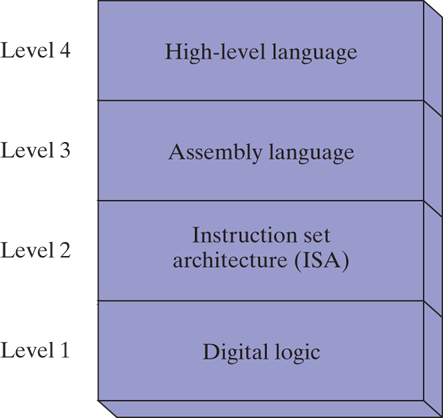

#### Page 67-68

###### Instruction Set Architecture (Level 2)

Computer chip manufacturers design into the processor an instruction set to carry out basic operations, such as move, add, or multiply. This set of instructions is also referred to as machine language. Each machine- language instruction is executed either directly by the computer's hardware or by a program embedded in the microprocessor chip called a ***microprogram***.

#### Page 68

###### Assembly Language (Level 3)

Above the ISA level, programming languages provide translation layers to make large-scale software development practical. Assembly language, uses short mnemonics such as `ADD`, `SUB`, and `MOV`, which are easily translated to the ISA level. Assembly language programs are translated (assembled) in their entirety into machine language before they begin to execute.

#### Page 73

###### Binary Integers

A computer stores instructions and data in memory as collections of electronic charges. Representing these entities with numbers requires a system geared to the concepts of on and off. Binary numbers are base `2` numbers in which each binary digit (called a bit) is either `0` or `1`. Bits are numbered sequentially starting at zero on the right side and increasing toward the left. The bit on the left is called the ***most significant bit (MSB)***, and the bit on the right is the ***least significant bit (LSB)***. The MSB and LSB bit numbers of a 16-bit binary number are shown in the following figure:

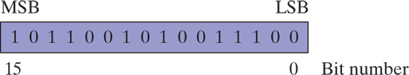

#### Page 79

###### Integer Storage Sizes

The basic storage unit for all data in an x86 computer is a byte, containing 8 bits. Other storage sizes are ***word*** (2 bytes), ***doubleword*** (4 bytes), and ***quadword*** (8 bytes).

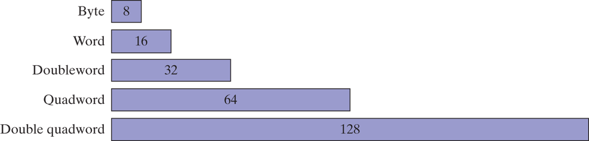

#### Page 83-84

###### Converting Unsigned Hexadecimal to Decimal

Suppose we number the digits in a four-digit hexadecimal integer with subscripts as $D_3D_2D_1D_0$. The following formula calculates the integer's decimal value:

$$
dec = (D_3 * 16^3) + (D_2 * 16^2) + (D_1 * 16^1) + (D_0 * 16^0)
$$

For example, hexadecimal `3BA4` is equal to $(3 * 16^3) + (11 * 16^2) + (10 * 16^1) + (4 * 16^0)$, or decimal `15,268`.

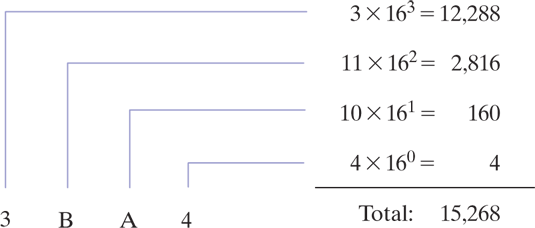

#### Page 85-86

###### Converting Unsigned Decimal to Hexadecimal

To convert an unsigned decimal integer to hexadecimal, repeatedly divide the decimal value by `16` and retain each remainder as a hexadecimal digit. For example, to convert `422` to hexadecimal:

```
422 / 16 = 26 (remainder 6)
26 / 16 = 1 (remainder A)
1 / 16 = 0 (remainder 1)
```

The resulting hexadecimal number is assembled from the digits in the remainder column, starting from the last row and working upward to the top row. In our case `1A6`.

#### Page 86

###### Hexadecimal Addition

Let's demonstrate this by adding `6A2` and `49A`. We start from right to left adding `2` to `A` (`2` and `10` in decimal), which is `C` (`12` in decimal). Then `A` and `9` (`10` and `9`), the result is `F3` (`19` in decimal), but since `19` is larger than our base number `16` we take the `3` and carry `1`. Finally we add `6`, `4`, and the `1` we are carrying, which is equal to `B` (`11` in decimal)

```
  6A2
+ 49A
-----
  B3C
```

The decimal counterparts of these numbers are `1698`, `1178`, and `2876` respectively.

#### Page 87

###### Signed Binary Integers

***Signed binary integers*** are positive or negative. For x86 processors, the MSB indicates the sign: `0` is positive and `1` is negative.

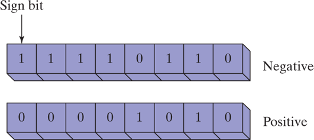

#### Page 87-88

###### Two's-Complement Representation

Negative integers use two's-complement representation, using the mathematical principle that the two's complement of an integer is its additive inverse. (If you add a number to its additive inverse, the sum is zero.)

The two's complement of a binary integer is formed by inverting its bits and adding `1`. Using the 8-bit binary value `00000001`, for example, its two's complement turns out to be `11111111`.

| Starting value                         | 00000001                          |
| -------------------------------------- | --------------------------------- |
| Step 1: Reverse the bits               | 11111110                          |
| Step 2: Add 1 to the value from Step 1 | &nbsp;&nbsp;11111110<br>+00000001 |
| Sum: Two's-complement representation   | 11111111                          |

#### Page 88-89

###### Hexadecimal Two's-Complement

To create the two's complement of a hexadecimal integer, reverse all bits and add `1`. An easy way to reverse the bits of a hexadecimal digit is to subtract the digit from `15`.

```
6A3D --> 95C2 + 1 --> 95C3
95C3 --> 6A3C + 1 --> 6A3D
```

#### Page 89-90

###### Converting Signed Binary to Decimal

To convert a signed binary we have to consider the value of its MSB:

- If the highest bit is a `1`, the number is stored in two's-complement notation. Create its two's complement a second time to get its positive equivalent. Then convert this new number to decimal as if it were an unsigned binary integer.
- If the highest bit is a `0`, you can convert it to decimal as if it were an unsigned binary integer.

Taking `11110000` as an example, these are the steps we would take to convert it to decimal:

| Starting value                         | 11110000                          |
| -------------------------------------- | --------------------------------- |
| Step 1: Reverse the bits               | 00001111                          |
| Step 2: Add 1 to the value from Step 1 | &nbsp;&nbsp;00001111<br>+00000001 |
| Step 3: Create the two's component     | 00010000                          |
| Step 4: Convert to decimal             | 16                                |

Because the original integer was negative, we know that its decimal value is `-16`.

#### Page 91

###### Converting Signed Hexadecimal to Decimal

- If the hexadecimal integer is negative, create its two's complement; otherwise, retain the integer as is.
- Using the integer from the previous step, convert it to decimal. If the original value was negative, attach a minus sign to the beginning of the decimal integer.

You can tell whether a signed hexadecimal integer is positive or negative by inspecting its most significant (highest) digit. If the digit is `>= 8`, the number is negative. For example, `8A20` is negative and `7FD9` is positive.

#### Page 92-94

###### Binary Subtraction

When subtracting binary numbers we have have to remember the rules as seen in the following table:

| - | 0 | 1 |
| - | - | - |
| 0 | 0 | 1 |
| 1 | 1 | 0 |

As we can see `0 - 0 = 0`, `1 - 0 = 1`, and `1 - 1 = 0`, but for `0 - 1` we have to borrow `1` from the digit to the left, making it `10 - 1 = 1`. For example:

```
  01101
- 00111
-------
  00110
```

This subtract `7` from `13`, and the result is effectively `6`.

Another approach to binary subtraction is to reverse the sign of the value being subtracted, and then add the two values. This method requires you to have an extra empty bit to hold the number's sign. Using this method first, we negate `00111` by inverting its bits (`11000`) and adding `1`, producing `11001`. Next, we add the binary values and ignore the carry out of the highest bit:

```
  01101
- 11001
-------
  00110
```

#### Page 95-96

###### Unicode Standard

The ***Unicode*** was created as a universal way of defining characters and symbols. It defines numeric codes (called ***code points***) for characters, symbols, and punctuation used in all major languages, as well as European alphabetic scripts, Middle Eastern right-to-left scripts, and many scripts of Asia. Three transformation formats are used to transform code points into displayable characters called ***Unicode Transformation Format (UTF)***:

- ***UTF-8*** used in HTML, and has the same byte values as ASCII.
- ***UTF-16*** used in environments that balance efficient access to characters with economical use of storage. Recent versions of Microsoft Windows, for example, use UTF-16. Each character is encoded in 16 bits.
- ***UTF-32*** used in environments where space is no concern and fixed-width characters are required. Each character is encoded in 32 bits.

#### Page 97-98

###### ASCII Control Characters

Character codes in the range `0` through `31` are called ***ASCII control characters***. If a program writes these codes to standard output, the control characters will carry out predefined actions.

| ASCII Code<br>(Decimal) | Description                                       |
| ----------------------- | ------------------------------------------------- |
| 8                       | Backspace (moves one column to the left)          |
| 9                       | Horizontal tab (skips forward *n* columns)        |
| 10                      | Line feed (moves to next output line)             |
| 12                      | Form feed (moves to next printer page)            |
| 13                      | Carriage return (moves to leftmost output column) |
| 27                      | Escape character                                  |

#### Page 99-100

###### Binary-Coded Decimal (BCD) Numbers

Decimal values can be stored in two general representations, commonly known as ***packed BCD*** and ***unpacked BCD***. These representations rely on the fact that a decimal digit can be represented by a maximum of `4` binary bits, from `0000` to `1001`.

###### Unpacked BCD

In *unpacked BCD*, one decimal digit is encoded in each binary byte. For example, `1,234,567` can be stored as an array of bytes: `01`, `02`, `03`, `04`, `05`, `06`, `07`, shown here in hexadecimal format. If the high-order digit occurs first in the sequence, we call that ***big-endian*** order (the opposite is called ***little-endian*** order). Numbers in *unpacked BCD* format can be of any arbitrary length and can be easily translated into displayable ASCII characters (by adding `30h`) to each byte. For example, if you add `30h` to the *unpacked BCD* value `07`, the result (`37h`) is the ASCII encoding of the displayable character `7`.

###### Packed BCD

In packed BCD format, two decimal digits are encoded in each binary byte. For example, the value `1,234,567` can be stored as the array of bytes (shown here in hexadecimal) as `01`, `23`, `45`, `67`. Because there are an odd number of digits, the upper `4` bits of the first byte can be all zeros, or they can be used to represent the number's sign.

#### Page 104-110

###### Boolean Expressions

A ***Boolean expression*** involves a Boolean operator and one or more operands. Each *Boolean expression* implies a value of true or false. The set of operators includes the following:

- `NOT`: notated as `¬` or `~` or `'`
- `AND`: notated as `∧` or `•`
- `OR`: notated as `∨` or `+`

The `NOT` operator is unary, and the other operators are binary. The operands of a *Boolean expression* can also be Boolean expressions.

The `AND` operation is often carried out at the bit level in assembly language. In the following example, each bit in `X` is `AND`ed with its corresponding bit in `Y`:

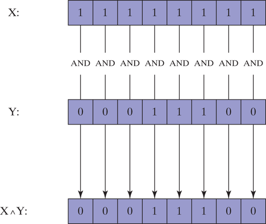

The `OR` operation is often carried out at the bit level. In the following example, each bit in `X` is `OR`ed with its corresponding bit in `Y:

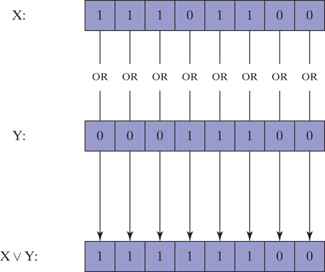

***Operator precedence*** rules are used to indicate which operators execute first in expressions involving multiple operators. In a *Boolean expression* involving more than one operator, precedence is important. The `NOT` operator has the highest precedence, followed by `AND` and `OR`. You can use parentheses to force the initial evaluation of an expression.

## Chapter 2 - x86 Processor Architecture

#### Page 130-132

###### Basic Microcomputer Design

***The central processor unit (CPU)***, where calculations and logical operations take place, contains a limited number of storage locations named ***registers*** , a high-frequency clock, a control unit, and an arithmetic logic unit.

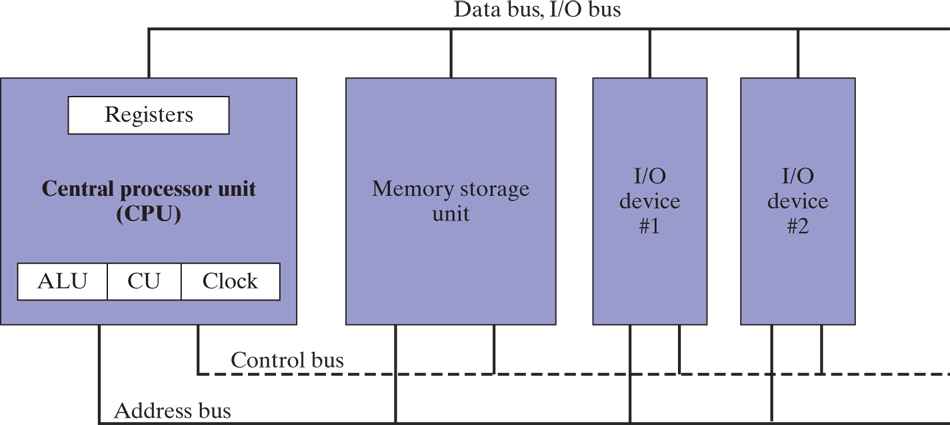

- The ***clock*** synchronizes the internal operations of the CPU with other system components.
- The ***control unit (CU)*** coordinates the sequencing of steps involved in executing machine instructions.
- The ***arithmetic logic unit (ALU)*** performs arithmetic operations such as addition and subtraction and logical operations such as `AND`, `OR`, and `NOT`.

Most CPU pins connect to the data bus, the control bus, and the address bus. The ***memory storage unit*** is where instructions and data are held while a program is running. The storage unit receives requests for data from the CPU, transfers data from ***random access memory (RAM)***, and transfers data from the CPU into memory. All processing of data takes place within the CPU, so programs residing in memory must be copied into the CPU before they can execute. Individual program instructions can be copied into the CPU one at a time, or groups of instructions can be copied together.

A ***bus*** is a parallel transfer path that moves data from one part of a computer to another. A computer system usually contains four bus types: data, input/output (I/O), control, and address. The ***data bus*** transfers instructions and data between the CPU and memory. The I/O bus transfers data between the CPU and the system I/O devices. The ***control bus*** uses binary signals to synchronize actions of all devices attached to the system bus. The ***address bus*** holds the addresses of instructions and data when the currently executing instruction transfers data between the CPU and memory.

#### Page 132-133

###### Clock

Each operation involving the CPU and the system bus is synchronized by an internal clock pulsing at a constant rate. The basic unit of time for machine instructions is a ***machine cycle*** (or ***clock cycle***). The length of a clock cycle is the time required for one complete clock pulse.

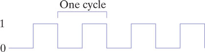

The duration of a clock cycle is calculated as the reciprocal of the clock's speed, which in turn is measured in oscillations per second. A clock that oscillates 1 billion times per second (1 GHz), for example, produces a clock cycle with a duration of one billionth of a second (1 nanosecond).

A machine instruction requires at least one clock cycle to execute. Instructions requiring memory access often have empty clock cycles called ***wait states*** because of the differences in the speeds of the CPU, the system bus, and memory circuits.

#### Page 133-135

###### Instruction Execution Cycle

1. First, the CPU has to **fetch the instruction** from an area of memory called the ***instruction queue***. Right after doing this, it increments the instruction pointer.
2. Next, the CPU **decodes** the instruction by looking at its binary bit patter. This bit pattern might reveal that the instruction has operands (input values).
3. If operands are involved, the CPU **fetches the operands** from registers and memory. Sometimes, this involves address calculations.
4. Next, the CPU **executes** the instruction, using any operand values it fetched during the earlier step. It also updates a few status flags, such as *Zero*, *Carry*, and *Overflow*.
5. Finally, if an output operand was part of the instruction, the CPU **stores the result** of its execution in the operand.

The three basic steps of this process are ***Fetch***, ***Decode***, and ***Execute***.

In order to read program instructions from memory, an address is placed on the address bus. Next, the memory controller places the requested code on the data bus, making the code available inside the ***code cache***. The instruction pointer's value determines which instruction will be executed next. The instruction is analyzed by the ***instruction decoder***, causing the appropriate digital signals to be sent to the control unit, which coordinates the ALU and floating-point unit. Although the control bus is not shown in the next figure, it carries signals that use the system clock to coordinate the transfer of data between the different CPU components.

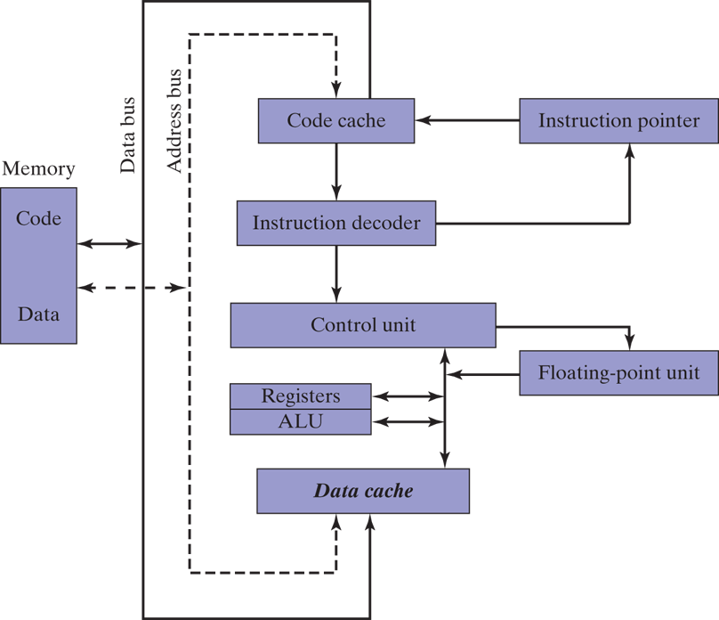

#### Page 135-137

###### Reading from Memory

Computers read memory much more slowly than they access internal registers. This is because reading a single value from memory involves four separate steps:

1. Place the address of the value you want to read on the address bus.
2. Assert (change the value of) the processor's RD (read) pin.
3. Wait one clock cycle for the memory chips to respond.
4. Copy the data from the data bus into the destination operand.

Each of these steps requires a single ***clock cycle***. Computer CPUs are often described in terms of their clock speeds. A speed of 1.2 GHz, for example, means the clock ticks, or oscillates, 1.2 billion times per second. So, 4 clock cycles go by fairly fast, considering each one lasts for only 1/1,200,000,000th of a second. Still, that's much slower than the CPU registers, which are usually accessed in only one clock cycle.

Computer memory creates a speed bottleneck because most programs have to access variables. That's why they store the most recently used instructions and data in high-speed memory called ***cache***. The idea is that a program is more likely to want to access the same memory and instructions repeatedly, so cache keeps these values where they can be accessed quickly. Also, when the CPU begins to execute a program, it can look ahead and load the next thousand instructions (to say a number) into cache, on the assumption that these instructions will be needed fairly soon. If there happens to be a loop in that block of code, the same instructions will be in cache. When the processor is able to find its data in cache memory, we call that a *cache hit*. If it tries to find something and it's not there, we call that a *cache miss*.

Cache memory for the x86 family comes in two types. ***Level-1 cache*** (or *primary cache*) is stored right on the CPU. ***Level-2 cache*** (or secondary cache) is a little bit slower, and attached to the CPU by a high-speed data bus.

Cache memory is constructed from a special type of memory chip called ***static RAM*** which does not have to be constantly refreshed, unlike conventional memor (***dynamic RAM***).

#### Page 137-138

###### Loading and Executing a Program

Before a program can run, it must be loaded into memory by a utility known as a ***program loader***. After loading, the operating system must point the CPU to the ***program's entry point***, which is the address at which the program is to begin execution. The following steps break this process down in more detail:

- The OS searches for the program's filename in the current disk directory. If it cannot find the name there, it searches a predetermined list of directories (*paths*) for the filename. If the OS fails to find the program filename, it issues an error message.
- If the program file is found, the OS retrieves basic information about the program's file from the disk directory, including the file size and its physical location on the disk drive.
- The OS determines the next available location in memory and loads the program file into memory. It allocates a block of memory to the program and enters information about the program's size and location into a table (sometimes called a descriptor table). The OS may also adjust the values of pointers within the program so they contain addresses of program data.
- The OS begins execution of the program's first machine instruction (its entry point). As soon as the program begins running, it is called a ***process***. The OS assigns the process an identification number (***process ID***), which is used to keep track of it while running.
- The process runs by itself. It is the OS's job to track the execution of the process and to respond to requests for system resources (memory, disk files, I/O devices, etc.).
- When the process ends, it is removed from memory.

#### Page 142-143

###### 32-Bit x86 Processors

x86 processors have three primary modes of operation: protected mode, real-address mode, and system management mode. A sub-mode, named ***virtual-8086***, is a special case of protected mode.

###### Protected Mode

Is the native state of the processor, in which all instructions and features are available. Programs are given separate memory areas named *segments*, and the processor prevents programs from referencing memory outside their assigned segments.

###### Virtual-8086 Mode

While in protected mode, the processor can safely execute real-address mode software such as MS-DOS programs in a sandbox-like environment named *virtual-8086* mode. In other words, if a program crashes or attempts to write data into the system memory area, it will not affect other programs running at the same time. A modern operating system can execute multiple separate virtual-8086 sessions at the same time.

###### Real-Address Mode

*Real-address mode* implements the programming environment of an early Intel processor with a few extra features, such as the ability to switch into other modes. This mode is useful if a program requires direct access to system memory and hardware devices. Current versions of the Windows operating system do not support Real-Address mode.

###### System Management Mode

*System management mode (SMM)* provides its host operating system with a mechanism for implementing functions such as power management and system security. These functions are usually implemented by computer manufacturers who customize the processor for a particular system setup.

#### Page 143-150

###### Basic Execution Environment

###### Address Space

In a 32-bit processor running in protected mode, a task or program can address a linear address space of up to 4 GBytes. Beginning with the P6 processor, a technique called ***extended physical addressing*** allows a total of 64 GBytes of physical memory to be addressed. Real-address mode programs, on the other hand, can only address a range of 1 MByte. If the processor is in protected mode and running multiple programs in virtual- 8086 mode, each program has its own 1-MByte memory area.

###### Basic Program Execution Registers

When a processing loop is optimized for speed, for example, loop counters are held in registers rather than variables. There are eight general-purpose registers, six segment registers, a processor status flags register (EFLAGS), and an instruction pointer (EIP).

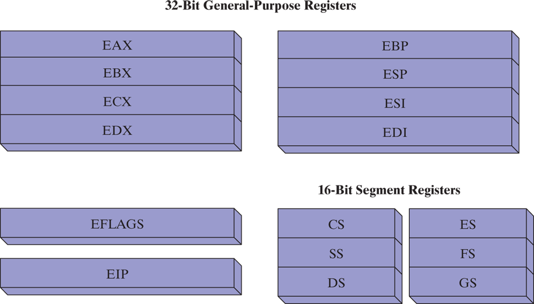

###### General-Purpose Registers

The *general-purpose registers* are primarily used for arithmetic and data movement.

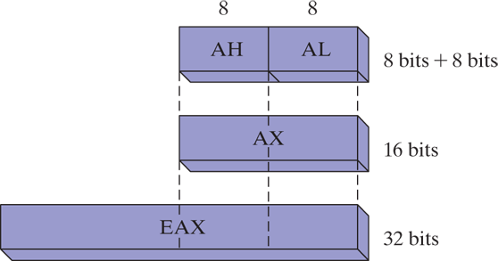

Portions of some registers can be addressed as 8-bit values. For example, the `AX` register has an 8-bit upper half named `AH` and an 8-bit lower half named `AL`. The same overlapping relationship exists for the `EAX`, `EBX`, `ECX`, and `EDX` registers:

| 32-Bit | 16-Bit | 8-Bit (High) | 8-Bit (Low) |
| ------ | ------ | ------------ | ----------- |
| EAX    | AX     | AH           | AL          |
| EBX    | BX     | BH           | BL          |
| ECX    | CX     | CH           | CL          |
| EDX    | DX     | DH           | DL          |

The remaining general-purpose registers can only be accessed using 32-bit or 16-bit names, as shown in the following table:

| 32-Bit | 16-Bit |
| ------ | ------ |
| ESI    | SI     |
| EDI    | DI     |
| EBP    | BP     |
| ESP    | SP     |

###### Specialized Uses

Some general-purpose registers have specialized uses:

- `EAX` is automatically used by multiplication and division instructions. It is often called the *extended accumulator* register.
- The CPU automatically uses `ECX` as loop counter.
- `ESP` addresses data on the stack (a system memory structure). It is rarely used for ordinary arithmetic or data transfer. It is often called the *extended stack pointer* register.
- `ESI` and `EDI` are used by high-speed memory transfer instructions. They are sometimes called the *extended source index* and *extended destination index* registers.
- `EBP`is used by high-level languages to reference function parameters and local variables on the stack. It should not be used for ordinary arithmetic or data transfer except at an advanced level of programming. It is often called the *extended frame pointer* register.

###### Segment Registers

In x86 protected mode, ***segment registers*** hold pointers to segment descriptor tables. Some segments hold program instructions (code), others hold variables (data), and another segment named the *stack segment* holds local function variables and function parameters.

###### Instruction Pointer

The `EIP`, or ***instruction pointer***, register contains the address of the next instruction to be executed. Certain machine instructions manipulate `EIP`, causing the program to branch to a new locatio.

###### EFLAGS Register

The ***EFLAGS*** (or just ***Flags***) register consists of individual binary bits that control the operation of the CPU or reflect the outcome of some CPU operation. Some instructions test and manipulate individual processor flags.

A flag is set when it equals 1; it is clear (or reset) when it equals 0.

###### Control Flags

***Control flags*** control the CPU's operation. For example, they can cause the CPU to break after every instruction executes, interrupt when arithmetic overflow is detected, enter virtual-8086 mode, and enter protected mode.

Programs can set individual bits in the EFLAGS register to control the CPU's operation. Examples are the *Direction* and *Interrupt* flags.

###### Status Flags

The **status flags** reflect the outcomes of arithmetic and logical operations performed by the CPU. They are the *Overflow*, *Sign*, *Zero*, *Auxiliary Carry*, *Parity*, and *Carry* flags.

- The ***Carry flag (CF)*** is set when the result of an *unsigned* arithmetic operation is too large to fit into the destination.
- The ***Overflow flag (OF)*** is set when the result of a *signed* arithmetic operation is too large or too small to fit into the destination.
- The ***Sign flag (SF)*** is set when an arithmetic or logical operation generates a negative result.
- The ***Zero flag (ZF)*** is set when an arithmetic or logical operation generates a result of zero.
- The ***Auxiliary Carry flag (AC)*** is set when an arithmetic operation causes a carry from bit `3` to `4` in an 8-bit operand.
- The ***Parity flag (PF)*** is set if the least-significat byte in the result contains an even number of `1` bits. Otherwise, *PF* is clear. In general, it is used for error checking when there is a possibility that data might be altered or corrupted.

###### MMX Registers

MMX technology improves the performance of Intel processors when implementing advanced multimedia and communications applications. The eight 64-bit ***MMX registers*** support special instructions called SIMD (***Single-Instruction, Multiple-Data***). As the name implies, MMX instructions operate in parallel on the data values contained in MMX registers. Although they appear to be separate registers, the MMX register names are in fact aliases to the same registers used by the floating-point unit.

###### XMM Registers

The x86 architecture also contains eight 128-bit registers called ***XMM registers***. They are used by streaming SIMD extensions to the instruction set.

###### Floating-Point Unit

The ***floating-point unit*** (FPU) performs high-speed floating-point arithmetic. At one time a separate coprocessor chip was required for this. From the Intel486 onward, the FPU has been integrated into the main processor chip. There are eight floating-point data registers in the FPU, named `ST(0)`, `ST(1)`, `ST(2)`, `ST(3)`, `ST(4)`, `ST(5)`, `ST(6)`, and `ST(7)`.

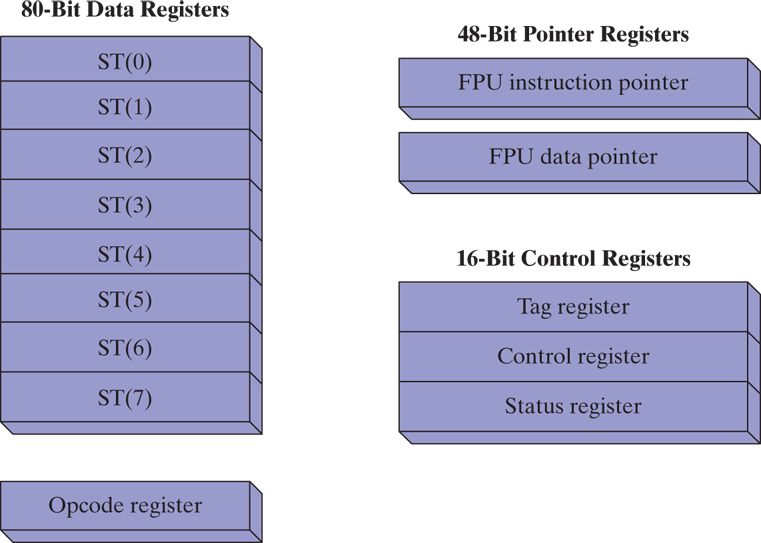

#### Page 150-151

###### x86 Memory Management

In *real-address mode*, only 1 MByte of memory can be addressed, from hexadecimal `00000` to `FFFFF`. The processor can run only one program at a time, but it can momentarily interrupt that program to process requests (called interrupts) from peripherals. Application programs are permitted to access any memory location, including addresses that are linked directly to system hardware. The MS-DOS operating system runs in *real-address mode*, and Windows 95 and 98 can be booted into this mode.

In *protected mode*, the processor can run multiple programs at the same time. It assigns each process a total of 4 GByte of memory. Each program can be assigned its own reserved memory area, and programs are prevented from accidentally accessing each other's code and data. MS-Windows and Linux run in *protected mode*.

In *virtual-8086 mode*, the computer runs in protected mode and creates a virtual-8086 machine with its own 1-MByte address space that simulates an 80x86 computer running in real-address mode. Windows NT and 2000, for example, create a virtual-8086 machine when you open a Command window. You can run many such windows at the same time, and each is protected from the actions of the others. Some MS-DOS programs that make direct references to computer hardware will not run in this mode under most versions of the Windows OS.

#### Page 155-156

###### 64-Bit x86-64 Processors

This group the Intel 64 and AMD64 processor families. The instruction set is a 64-bit extension of the x86 instruction set we've already looked at. Here are some of the essential features:

1. It is backward-compatible with the x86 instruction set.
2. Addresses are `64` bits long, allowing for a virtual address space of size $2^{64}$ bytes. In current chip implementations, only the lowest `48` bits are used.
3. It can use 64-bit general-purpose registers, allowing instructions to have 64-bit integer operands.
4. It uses eight more general-purpose registers than the x86.
5. It uses a 48-bit physical address space, which supports up to 256 terabytes of RAM.

On the other hand, when running in native 64-bit mode, these processors do not support 16-bit real mode or virtual-8086 mode. (There is a legacy mode that still supports 16-bit programming, but it is not available in 64- bit versions of Microsoft Windows.)

#### Page 156-157

###### 64-Bit Operation Modes

The Intel 64 architecture introduces a new mode named ***IA-32e***. Technically it contains two submodes, named *compatibility mode* and ***64- bit mode***. But it's easier to refer to these as modes rather than submodes.

###### Compatibility Mode

When running in *compatibility mode* (also known as *32-bit mode*), existing 16-bit and 32-bit applications can usually run without being recompiled. However, 16-bit Windows (Win16) and DOS applications will not run in 64-bit Microsoft Windows. Unlike earlier versions of Windows, 64-bit Windows does not have a virtual DOS machine subsystem to take advantage of the processor's ability to switch into virtual-8086 mode.

###### 64-Bit Mode

In *64-bit mode*, the processor runs applications that use the 64-bit linear address space. This is the native mode for 64-bit Microsoft Windows. This mode enables 64-bit instruction operands.

#### Page 157-159

###### Basic 64-Bit Execution Environment

In 64-bit mode, addresses can theoretically be as large as 64-bits, although processors currently only support 48 bits for addresses. In terms of registers, the following are the most important differences from 32-bit processors:

- Sixteen 64-bit general purpose registers (in 32-bit mode, you have only eight general-purpose registers)
- Eight 80-bit floating-point registers
- A 64-bit status flags register named `RFLAGS` (only the lower 32 bits are used)
- A 64-bit instruction pointer named `RIP`

###### General-Purpose Registers

In 64-bit mode, the default operand size is `32` bits and there are eight general-purpose registers. By adding the `REX` (register extension) prefix to each instruction, however, the operands can be `64` bits long and a total of `16` general-purpose registers become available. You have all the same registers as in 32-bit mode, plus eight numbered registers, `R8` through `R15`.

| Operand Size | Available Registers                                                                  |
| ------------ | ------------------------------------------------------------------------------------ |
| 8 bits       | AL, BL, CL, DL, DIL, SIL, BPL, SPL, R8L, R9L, R10L, R11L, R12L, R13L, R14L, R15L     |
| 16 bits      | AX, BX, CX, DX, DI, SI, BP, SP, R8W, R9W, R10W, R11W, R12W, R13W, R14W, R15W         |
| 32 bits      | EAX, EBX, ECX, EDX, EDI, ESI, EBP, ESP, R8D, R9D, R10D, R11D, R12D, R13D, R14D, R15D |
| 64 bits      | RAX, RBX, RCX, RDX, RDI, RSI, RBP, RSP, R8, R9, R10, R11, R12, R13, R14, R15         |

- In 64-bit mode, a single instruction cannot access both a high-byte register, such as `AH`, `BH`, `CH`, and `DH`, and at the same time, the low byte of one of the new byte registers (such as `DIL`).
- The 32-bit `EFLAGS` register is replaced by a 64-bit `RFLAGS` register in 64-bit mode. The two registers share the same lower `32` bits, and the upper `32` bits of `RFLAGS` are not used.
- The status flags are the same in 32-bit mode and 64-bit mode.

#### Page 163-166

###### Components of a Typical x86 Computer

###### Motherboard

The heart of a microcomputer is its *motherboard*, a flat circuit board onto which are placed the computer's CPU, supporting processors (chipset), main memory, I/O connectors, power supply connectors, and expansion slots. The various components are connected to each other by a *bus*, a set of wires etched directly on the motherboard. The following components have traditionally been found on PC motherboards:

- A CPU socket
- Memory slots (SIMM or DIMM)
- ***BIOS (basic input-output system)*** computer chips, holding system software
- CMOS RAM, with a small battery to keep it powered
- Connectors for mass-storage devices such as hard drives and CD-ROMs
- USB connectors for external devices
- Keyboard and mouse ports
- PCI bus connectors for sound cards, graphics cards, data adquisition boards, and other I/O devices

The following components are optional:

- Integrated sound processor
- Parallel and serail device connectors
- Integrated network adapter
- AGP bus connector for a high-speed video card

Following are some important support processors in a typical legacy system:

- The ***Floating-Point Unit*** (FPU) handles floating-point and extended integer calculations.
- The 8284/82C284 *Clock Generator*, known simply as the clock, oscillates at a constant speed. The clock generator synchronizes the CPU and the rest of the computer.
- The 8259A ***Programmable Interrupt Controller (PIC)*** interface handles external interrupts from hardware devices, such as the keyboard, system clock, and disk drives. These devices interrupt the CPU and make it process their requests immediately.
- The 8253 ***Programmable Interval Timer/Counter*** interrupts the system 18.2 times per second, updates the system date and clock, and controls the speaker. It is also responsible for constantly refreshing memory because RAM memory chips can remember their data for only a few milliseconds.
- The ***Universal Serial Bus (USB) controller*** transfers data to and from devices connected to USB ports.

###### PCI and PCI Express Bus Architectures

The *PCI (Peripheral Component Interconnect)* bus provides a connecting bridge between the CPU and other system devices such as hard drives, memory, video controllers, sound cards, and network controllers. The *PCI Express* bus provides two-way serial connections between devices, memory, and the processor. It carries data in packets, similar to networks, in separate "lanes". It has been widely supported by graphics controllers, and has been used for many years to transfer data at high speed.

###### Motherboard Chipset

Is a collection of processor chips designed to work together on a specific type of motherboard. Various chipsets have implemented features that increase processing power, multimedia capabilities, or reduce power consumption. The *Intel P965 Express Chipset* can be used as an example. It has been used in desktop PCs for many years, with Intel Core 2 Duo and Pentium D processors. Here are some of its features:

- Intel *Fast Memory Access* uses an updated Memory Controller Hub (MCH). It can access dual-channel DDR2 memory, at an 800-MHz clock speed.
- An I/O Controller Hub (Intel ICH8/R/DH) uses Intel Matrix Storage Technology (MST) to support multiple Serial ATA devices (disk drives).
- Support for multiple USB ports, multiple PCI express slots, networking, and Intel Quiet System technology.
- A high definition audio chip provides digital sound capabilities.

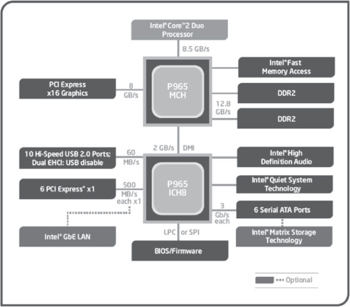

#### Page 166-167

###### Memory

Several basic types of memory have been used in Intel-based systems for many years: ***read-only memory (ROM)***, erasable programmable read-only memory (EPROM), dynamic random-access memory (DRAM), ***static RAM*** (SRAM), video RAM (VRAM), and complementary metal oxide semiconductor (CMOS) RAM:

- ***ROM*** is permanently burned into a chip and cannot be erased.
- ***EPROM*** can be erased slowly with ultraviolet light and reprogrammed.
- ***DRAM***, commonly known as main memory, is where programs and data are kept when a program is running. It is inexpensive, but must be refreshed every millisecond to avoid losing its contents. Some systems use ECC (error checking and correcting) memory.
- ***SRAM*** is used primarily for expensive, high-speed cache memory. It does not have to be refreshed. CPU cache memory uses SRAM.
- ***VRAM*** holds video data. It is dual ported, allowing one port to continuously refresh the display while another port writes data to the display.
- ***CMOS RAM*** on the system motherboard stores system setup information. It is refreshed by a battery, so its contents are retained when the computer's power is off.

#### Page 171-175

###### Input–Output System

###### Levels of I/O Access

Application programs routinely read input from keyboard and disk files and write output to the screen and to files. I/O need not be accomplished by directly accessing hardware —instead, you can call functions provided by the operating system. There are three primary levels:

- **High-level language functions**: A high-level programming language contain functions to perform I/O. These functions are portable because they work on a variety of different computer systems and are not dependent on any one operating system.
- **Operating system**: Operating system functions can be called from a library known as the operating system API. The operating system provides high-level operations such as writing strings to files, reading strings from the keyboard, and allocating blocks of memory.
- **BIOS**: The basic input–output system is a collection of low-level subroutines that communicate directly with hardware devices. The BIOS is installed by the computer's manufacturer and is tailored to fit the computer's hardware. Operating systems typically communicate with the BIOS.

###### Device Drivers

***Device drivers*** are programs that permit the operating system to communicate directly with hardware devices and the system BIOS. For example, a device driver might receive a request from the OS to read some data; the device driver satisfies the request by executing code in the device firmware that reads data in a way that is unique to the device. Device drivers are usually installed in one of two ways: (1) before a specific hardware device is attached to a computer, or (2) after a device has been attached and identified. In the latter case, the OS recognizes the device name and signature; it then locates and installs the device driver software onto the computer.

For example this is what happens when an application program displays a string of characters on the screen:

1. A statement in the application program calls an HLL library function that writes the string to standard output.
2. The library function (Level 3) calls an operating system function, passing a string pointer.
3. The operating system function (Level 2) uses a loop to call a BIOS subroutine, passing it the ASCII code and color of each character. The operating system calls another BIOS subroutine to advance the cursor to the next position on the screen.
4. The BIOS subroutine (Level 1) receives a character, maps it to a particular system font, and sends the character to a hardware port attached to the video controller card.
5. The video controller card (Level 0) generates timed hardware signals to the video display that control the raster scanning and displaying of pixels.

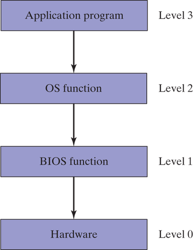

###### Programming at Multiple Levels

Assembly language can choose from the following access levels:

- Level 3: Call library functions to perform generic text I/O and file- based I/O.
- Level 2: Call operating system functions to perform generic text I/O and file-based I/O. If the OS uses a graphical user interface, it has functions to display graphics in a device-independent way.
- Level 1: Call BIOS functions to control device-specific features such as color, graphics, sound, keyboard input, and low-level disk I/O.
- Level 0: Send and receive data from hardware ports, having absolute control over specific devices. This approach cannot be used with a wide variety of hardware devices, so we say that it is not portable. Different devices often use different hardware ports, so the program code must be customized for each specific type of device.

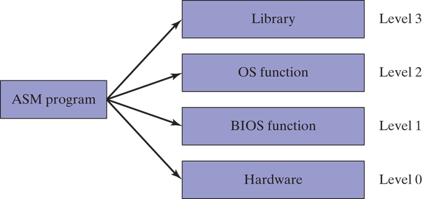

Level 2 works on any computer running the same OS. If an I/O device lacks certain capabilities, the OS will do its best to approximate the intended result. Level 2 is not particularly fast because each I/O call must go through several layers before it executes.

Level 1 works on all systems having a standard BIOS, but will not produce the same result on all systems. For example, two computers might have video displays with different resolution capabilities. A programmer at Level 1 would have to write code to detect the user's hardware setup and adjust the output format to match. Level 1 runs faster than Level 2 because it is only one level above the hardware.

Level 0 works with generic devices such as serial ports and with specific I/O devices produced by known manufacturers. Programs using this level must extend their coding logic to handle variations in I/O devices. Real-mode game programs are prime examples because they usually take control of the computer. Programs at this level execute as quickly as the hardware will permit.