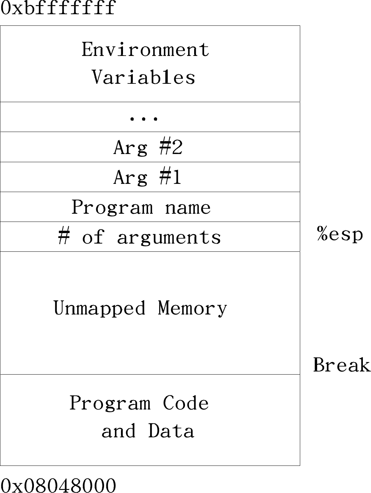
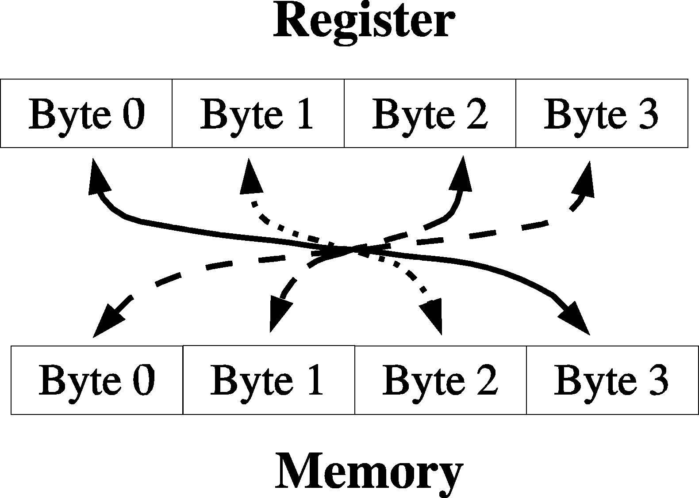

# Programming From The Ground Up

The book *Programming From The Ground Up* can be accessed completely free and legally [here](https://download-mirror.savannah.gnu.org/releases/pgubook/ProgrammingGroundUp-1-0-booksize.pdf).

## Chapter 2 - Computer Architecture

#### Pag 7

Modern computers used the Von Newman architecture, which divides the computer into CPU and memory

#### Pag 9

The CPU reads instructions from memory one at a time. This is known as the fetch-execution cycle

The elements of the CPU are: Program Counter, Instruction Decoder, Data Bus, General-purpose Registers, and Arithmetic and Logic Unit

#### Pag 9-10

The ***Program Counter*** is used to tell the computer where to fetch the next instruction from. It holds the memory address of the next instruction to be executed.

It is then passed to the ***Instruction Decoder*** which figures out what the instruction mean. This includes what process needs to take place and what memory locations are going to be involved in this process.

At this point the ***Data Bus*** will fetch the memory locations to be used in the calculation. The Data Bus is the connection between the memory and the CPU, literally, the CPU and the memory are connected in a motherboard, that's the actual data bus.

Now, data is brought from memory into ***Registers*** (a special high-speed memory built into the CPU), procesed, and then put back into memory again.

There are two types of ***Registers***, ***General-purpose Registers***, and ***Special-purpose Registers***. 

***General-purpose Registers*** take care of operations such as addition, subtraction, multiplication, and comparisson (***Special-purpose Registers*** are not important at the moment).

Finally the data is passed to the ***Arithmetic and Logic Unit*** where data is further processed, executed, and eventually put back into the given bus and sent to the right memory address or register.

The ***fetch-execute*** cycle works as follows:

Program Counter > Instruction Decoder > Data Bus > (General Purpose) Registers > Arithmetic and Logic Unit

#### Pag 11

The size of a single memory storage location is a byte, in x86 architecture that's a number between 0 and 255.

#### Pag 12

In x86 architecture registers are 4 bytes long each, the size of a Register is know as a computer's word, so in x86 CPUs we have 4 byte words. Memory addresses are also 4 bytes long (1 word), so they can fit in a Register. Addresses that are stored in memory are called pointers, because instead of having a regular value in them they point you to a different location in memory.

#### Pag 13

A Special-Purpose Register called the Instruction Pointer manages pointers

#### Pag 15-16

Processors have different ways of accessing data, including: Immediate Mode, Register Addressing Mode, Direct Addressing Mode, Indexed Addressing Mode, and Base Pointer Addressing Mode.

- **Immediate Mode**: if we want to initialize a register to 0, instead of giving the computer an address to read the 0 from, we would specify Immediate Mode, and give it the number 0.
- **Register Addressing Mode**: in this mode the register contains a register to access rather than a memory location.
- Direct Addressing Mode: the instruction contains the memory address to access
- **Indexed Addressing Mode**: the instruction contains a memory address to access, and also specifies an index register to offset that address. For example if the addresss is 2002 and the index is 4, the address loaded will be 2006. On x86 processors you can also specify a multiplier for the index
- **Indirect Addressing Mode**: the instruction constains a register that contains a pointer to where the data should be accessed. It goes from register, to pointer, to memory address, to value
- **Base Pointer Addressing Mode**: similar to Indirect Addressing Mode, but you also include an offset to add to the register's value before using it for lookup

## Chapter 3 - Your First Programs

#### Page 20-21

To turn a source code Assembly file into a program it must first be *assembled* and *linked* it.

***Assembling*** is the process that transform what we wrote into instructions for the machine.

To *assemble* the file [exit.s](./chapter3/exit.s) the following command must be run:

```bash
as exit.s -o exit.o
```

**Note:** this assumes a Linux machine is being used, and the package `binutils` is installed.

`exit.o` is what is known as an object file, which is code that is in the machine's language, but has not been completely put together.

The ***linker*** is the program that is responsible for putting the object files together and adding information so the kernel knows how to load and run it.

To *link* the file [exit.o](./chapter3/exit.o) the following command must be run:

```bash
ld exit.o -o exit
```

#### Page 23-28

Anything starting with a period (in our `exit.s` file would be `.section .data`, `.section .text`, and ` .globl _start`) is not translated into a machine instruction but used by the assembler itself. These are called ***Assembler directives*** or ***Pseudo-operations***.

`.section .data` starts the data section, where any memory storage needed for data is usually listed.

`.section .text` is where the program instructions live.

`.globl _start` defines a ***symbol*** called `_start`. *Symbols* are generally used to mark locations of programs or data, so you can refer to them by name instead of by their location number.

`.globl` means that the *assembler* should not discard the following symbol after *assembly* because the *linker* will need it. `_start` is a special symbol that always need to be marked with `.globl` because it marks the location of the start of the program.

`_start:` defines the value of the `_start` ***label***. A ***label*** is a *symbol* followed by a colon. *Labels* define a *symbol*'s value.

`movl $1, %eax` this instruction moves the number `1` to the `%eax` register. The instruction `movl` has two operands, the *source* and the *destination*. In this case the *source* is the literal number `1` and the *destination* is the `%eax` register. Operands can be numbers, memory location references, or registers. The dollar-sign in front of the one (`1`) indicates we want to use *immediate mode addressing*, without it, it would do *direct addressing*, loading whatever number is at address `1`.

The number `1` has to be moved to `%eax` because we are preparing to call the Linux kernel, and number `1` represents the `exit` *system call*.

For the `exit` *system call* the operating system requires a status code to be loaded in `%ebx`.

`movl $0, %ebx` moves the literal value `0` to the `%ebx` register (similar to what `movl $1, %eax` does).

`int $0x80`, the `int` stands for ***interrupt***. The `0x80` is the interrupt number to use (the `0x` prefix indicates this is a hexadecimal number). An *interrupt* interrupts the normal program flow and transfers control to Linux so that will do a system call.

#### Page 31-40

**Note**: In this section we explain the program [maximum.s](./chapter3/maximum.s).

```assembly
data_items:
    .long 3,67,34,222,45,75,54,34,44,33,22,11,66,0
```

This line defines a label (`data_items`), then we have the directive `.long` that reseves 4 bytes for each one of the numbers that follow it.

Other directives to reserve different size memory locations:

- `.byte`: takes a number between 0 and 255
- `.int`: not to be confused with the `int` instruction! Takes a number from 0 to 65535 (2 bytes)
- `.long`: takes a number between 0 and 4294967295 (4 bytes, the same space as a register)
- `.ascii`: used to represent characters in memory. Each character takes 1 byte, and a `\0` represents a termination character (end of the string). Other special characters like `\n` and `\t` are also supported

`movl $0, %edi` sets the current index at `0`, since `0` represents the first element of our list of *long*s.

`movl data_items(,%edi,4), %eax`, in this line we are using *Indexed Addressing Mode*, we are asking our program to begin at the address associated with the label `data_items`, take the item at index `0` (because %edi at the moment is `0`), which occupies 4 bytes. We take that value and put it in the register `%eax`, thus saving the first number of our list (`3`) as the highest number so far (because is the only one we have seen) in register `%eax`.

```assembly
cmpl $0, %eax
je loop_exit
```

In these two lines we start by comparing the value `0` to whatever the value in `%eax` is (`cmpl` stands for *compare long*). Then we jump to the label `loop_exit` if the values are equal (`je` stands for *jump equal*) which means we reached the end of the list. The result of the comparison is stored in the `%eflags` register, which is known as the ***status register***.

Other comparisson instructions:

- `jg`: jump if the second value is greater than the first one
- `jge`: jump if the second value is greater than or equal the first one
- `jl`: jump if the second value is less than the first one
- `jle`: jump if the second value is less than or equal the first one
- `jmp`: jump no matter what. It dos not need to be preceeded by a comparison

```assembly
incl %edi
movl data_items(,%edi,4), %eax
```

`incl %edi` (*increment long*) increments the value stored in `%edi` (our current index) by `1`. Then the next line takes the current number in the list and puts it in `%eax` as seen before.

```assembly
cmpl %ebx, %eax
jle start_loop
```

In here we compare if the current value (`%eax`) is less than or equal to our max value (`%ebx`) and if it is we jump to `start_loop`.

```assembly
movl %eax, %ebx
jmp start_loop
```

If the last comparisson didn't trigger a jump to `start_loop` it means our current value (stored in `%eax`) is greater than our max value (stored in `%ebx`), which means `%ebx` has to be updated, what we do, and then jump to `start_loop`.

#### Page 42-43

**Note**: This section covers how to actually use the different addressing modes.

***Direct Addressing Mode*** as the name implies, in this mode we directly use the memory address. In the following example we are copying the value in `ADDRESS` to `%eax`:

```assembly
movl ADDRESS, %eax
```

***Indirect Addressing Mode*** loads a value from the address indicated by a register and we can use it as illustrated next:

```assembly
movl (%eax), %ebx
```

***Base-pointer Addressing Mode*** is similar to *Indirect Addressing Mode*, except it adds a constant value to the address in the register. For example, the following example takes the memory address in `%eax` (let's say `1000`) and adds 4 bytes (turning it into `1004`):

```assembly
movl 4(%eax), %ebx
```

#### Page 44

**Note**: This section covers how to operate at different levels besides the word level (4 bytes at a time).

The instruction `movb` will move 1 byte instead of 4 at a time.

The register `%ax` represents the least-significant half (last two bytes) of the register `%eax`, it can be use to do operations 2 bytes at a time. `%ax` is divided into `%al` and `%ah`, `%al` being the least-significant byte of `%ax` and `%ah` being the most-significant byte. Think `l` for low priority and `h` for high priority. Since all these registers are related (`%eax`, `%ax`, `%ah` and `%al`) operating in one will change the values in the others, so **be cautious**.

## Chapter 4 - All About Functions

#### Page 53-58

The register `%esp` contains a pointer to the current top of the ***stack*** (reminder: the stack is a region in memory that works, precisely, as a stack or LIFO data structure). The actual stack in memory starts at the top of the memory and grows downward, this is due to architectural considerations.

A value can be pushed to the top of the stack with the instruction `pushl`, and popped with `popl`. When we push a value to the top of the stack `%esp` gets subtracted by `4` (if it was previously `1000` then it becomes `996`), popping adds `4` to `%esp`. 

Besides `pushl` and `popl` we can use the different addressing modes to access it, without modifying it. For example, accessing the top of the stack without popping it by using *Indirect Addressing Mode*:

```assembly
movl (%esp), %eax
```

Or accessing the value just below the top of the stack by using *Base-pointer Addressing Mode*:

```assembly
movl 4(%esp), %eax
```

In the C language calling convention (which we are going to use here), the stack is the key element for
implementing a function's local variables, parameters, and return address.

Before executing a function, a program pushes all of the parameters for the function onto the stack in the reverse order that they are documented (i.e. `param3`, `param2`, `param1` instead of `param1`, `param2`, `param3`). Then the program issues a call instruction indicating which function it wishes to start. The call instruction does two things. First it pushes the address of the next instruction, which is the return address, onto the stack. Then it modifies the instruction pointer (%eip) to point to the start of the function. This is better represented visually in the next following:

```
Parameter #N
...
Parameter 2
Parameter 1
Return Address <--- (%esp)
```

**Note**: the "top" of the stack is represented at the bottom in that last example.

The first thing to do in a function is save the current ***base pointer*** `%ebp` by calling `pushl %ebp`. The base pointer is a special register used for accessing function parameters and local variables. Next, we have to copy the stack pointer to `%ebp` by doing `movl %esp, %ebp`. This help us access the function parameters as fixed indexes from the base pointer instead of the stack, since this can be changed at any point.


`%ebp` represents now the state of the stack at the moment of calling our function, or our ***stack frame***. So far the stack looks like follows:

```
Parameter #N    <--- N*4+4(%ebp)
...
Parameter 2     <--- 12(%ebp)
Parameter 1     <--- 8(%ebp)
Return Address  <--- 4(%ebp)
Old %ebp        <--- (%esp) and (%ebp)
```

As you can see, each parameter can be accessed using base pointer addressing mode using the `%ebp` register.

The next thing to do is to reserve space on the stack for any local variables we plan on using, for example, assuming we are going to use `2` local variables we can reserve `8` bytes by subtracting `8` to the top of the stack:

```assembly
subl $8, %esp
```

It is important to note that when we return, the stack frame will go away, disposing of our variables.

With this in mind the stack will look like this:

```
Parameter #N      <--- N*4+4(%ebp)
...
Parameter 2       <--- 12(%ebp)
Parameter 1       <--- 8(%ebp)
Return Address    <--- 4(%ebp)
Old %ebp          <--- (%ebp)
Local Variable 1  <--- -4(%ebp)
Local Variable 1  <--- -8(%ebp) and (%esp)
```

When a function is done executing it does these 3 things:

1. It stores its return value in `%eax`
2. It resets the stack to what it was when it was called (it gets rid of the current stack frame and puts the stack frame of the calling code back into effect)
3. It returns control back to wherever it was called from. This is done using the `ret` instruction, which pops whatever value is at the top of the stack, and sets the instruction pointer, `%eip` to that value.

Before a function returns, it must restore the stack to the state it was before the function was called. The instruction `ret` will not work unless we do this because is expecting our return address to be at the top of the stack. Therefore, before returning we have to reset the *stack pointer* (`%esp`) and *base pointer* (`%ebp`) to what they were when the function began. We can achieve that by doing the following:

```assembly
movl %ebp, %esp
popl %ebp
ret
```

At this point we should consider all local variables to be disposed of. Technically they still exist in memory (or so I understand) but since we moved the stack pointer back, future pushes will overwrite those values, so we shouldn't rely on them.

Control has now beenhanded back to the calling code, which can now examine `%eax` for the return value. The calling code also needs to pop off all of the parameters it pushed onto the stack in order to get the stack pointer back where it was. One could also simply add `4 * number of paramters` to `%esp` using the `addl` instruction, if the values of the parameters aren't needed anymore.

#### Page 62-63

**Note**: In this section we explain the program [power.s](./chapter4/power.s).

**Note**: this book assumes we are working on a 32 bit CPU, if that is not the case the flag `--32` must be passed when *assembling* a file like so: `as power.s -o power.o --32`. Meanwhile when *linking* we should add the following `-m elf_i386` to the linker command, like this: `ld -m elf_i386 power.o -o power`.

```assembly
.type power,@function
```

This line instructs the linker to use the symbol `power` as a function.

```assembly
power:
  pushl %ebp
  movl  %esp, %ebp
  subl  $4, %esp
```

At this point, our stack looks like this:

```
Base Number     <---  12(%ebp)
Power           <---  8(%ebp)
Return Address  <---  4(%ebp)
Old %ebp        <---  (%ebp)
Current result  <---  -4(%ebp) and (%esp)
```

The instruction `imull` does integer multiplication and stores the result in the second operand, while `decl` decreases the given register by `1`.

#### Page 66-71

**Note**: In this section we explain the program [factorial.s](./chapter4/factorial.s).

```assembly
_start:
  pushl $4
  call  factorial
```

Since the program is supposed to compute the factorial of `4` we start by pushing `4` (if could have been any number) to the top of the stack. Then we call the `factorial` function.

```assembly
addl $4, %esp
movl %eax, %ebx
movl $1, %eax
int $0x80
```

In this last snippet the line `addl $4, %esp` restore the stack to where it was before calling the `factorial` function. Remember that the stack works from top to bottom, so by calling `addl` we are freeing space, `subl` on the other hand would reserve space. Next we are taking the return value of the function (`%eax`), moving it to `%ebx`, which expects the program exit's status, and then we do a stardard system call.

```assembly
.type factorial, @function
factorial:
  pushl %ebp
  movl  %esp, %ebp
```

As seen before, these lines define a function and point `%esp` to the top of the stack.

```assembly
movl 8(%ebp), %eax
```

In here we *base pointer addressing* to move (actually copy) the first parameter of the function into `%eax`. How come the first parameter is in `8(%ebp)`? Here's an explanation:

- `(%ebp)` has the old `(%ebp)`
- `4(%ebp)` has the return address
- `8(%ebp)` is the location of the first (and only) parameter of the function

```assembly
cmpl $1, %eax
je   end_factorial
```

Then we check if `%eax` is equal to `1`, if so, we jump to the label `end_factorial`.

```assembly
decl  %eax
pushl %eax
call  factorial
```

If `%eax` is not equal to `1` we decrease it by `1`, push it to the stack, and call `factorial` again.

```assembly
movl 8(%ebp), %ebx
imull %ebx, %eax
```

What these lines do was a little obscure to me at first, then I understood their purpose. An explanation:

After calling a function we lose control of the registers, they could be holding any value, or none at all, except `%esp` and `%ebp` of course. So after calling the function `factorial` with the number `4` and this calling itself with the number `3` we should resume execution after `factorial` has called itself with number `3`, `2` and `1`, that's `3!`, which equals `9`, and since `4!` is equal to `4 * 3!`, we put the original parameter (`4`) into a temporary variable with `movl 8(%ebp), %ebx`, and multiply this variable with the result of the second call to `factorial` (`%eax`) as in `imull %ebx, %eax`. Now `%eax` holds the value of `4!`.

```assembly
end_factorial:
  movl  %ebp, %esp
  popl  %ebp
  ret
```

Finally we destroy the current stack frame, reactivate the previous one, and return control to the main program.

## Chapter 5 - Dealing with Files

#### Page 75-79

To work with files we use the ***Unix Method***, which works as follows:

1. Tell Linux the name and mode (read, write, etc.) of the file to open. For this we use the `open` system call, which takes a filename, a number representing the mode, and a permission set as parameters. `%eax` will hold the system call number, which is `5`. The address of the first character of the filename should be stored in `%ebx`. The read/write intentions, represented as a number, should be stored in `%ecx` (for example `0` is for read, and `03101` is for write). Finally, the permission set should be stored as a number in `%edx`.
2. Linux will return a ***file descriptor*** in `%eax`. A *file descriptor* is a number used to refer to the file. You can use the *file descriptor* for reading and writing to the file. When you close the file, the *file descriptor* becomes useless.
3. At this point is time to make read or write operations in the file. `read` is a system call `3` and to call it you need to have your *file descriptor* in `%ebx`, the address of a buffer (a continuous block of bytes used for bulk data transfer) for storing the data that is read in `%ecx`, and the size of the buffer in `%edx`. `read` will return with either the number of characters read from the file, or a negative number representing an error code. `write` is system call `4`, and requires the same parameters as `read`, except that the buffer should already be filled with the data to write out. `write` will return the number of bytes written in `%eax` or an error code.
4. Finally tell Linux to close the file with `close`, system call `6`. The only parameter to `close` is the *file descriptor*, which is placed in `%ebx`.

Buffers are a fixed size, set by the programmer. If
you want to read in data `500` bytes at a time, you send the `read` system call the address of a 500-byte unused location, and send it the number `500` so it knows how big it is.

To avoid using space in the final executable buffers can be put in the `.bss` section. The `.bss` section is like `.data`, except you cannot initialize the addresses you reserve in there, which makes it perfect for buffers. For example:

```assembly
.section .bss
  .lcomm my_buffer, 500
```

In here we use the `lcomm` directive to create a symbol called `my_buffer` that refers to a 500-byte storage location that we can use as a buffer. Note that that 500-byte storage space is not initialized yet, thus it doesn't take space in the executable file. Assuming we are reading a file (so our *file descriptor* is in `%ebx`), we could do the following:

```assembly
movl $my_buffer, %ecx
movl 500, %edx
movl 3, %eax
int  $0x80
```

Note that we use *immediate addressing mode* with `my_buffer` so we can access the value it holds which is the address of the **start** of our buffer.

There are 3 *file descriptors* in Linux that don't refer to typical files, but special files (which in fact are not files but can be written or read as if they were):

1. `STDIN`: This is the standard input. It is a read-only file, and usually represents your keyboard. This is always file descriptor `0`.
2. `STDOUT`: This is the standard output. It is a write-only file, and usually represents your screen display. This is always file descriptor `1`.
3. `STDERR`: This is your standard error. It is a write-only file, and usually represents your screen display. Most regular processing output goes to `STDOUT`, but any error messages that come up in the process go to `STDERR`. This way, if you want to, you can split them up into separate places. This is always file descriptor `2`.

#### Page 88-93

**Note**: In this section we explain the program [toupper.s](./chapter5/toupper.s).

```assembly
.equ SYS_OPEN, 5
.equ SYS_WRITE, 4
.equ SYS_READ, 3
.equ SYS_CLOSE, 6
.equ SYS_EXIT, 1

.equ O_RDONLY, 0
.equ O_CREAT_WRONLY_TRUNC, 03101

.equ STDIN, 0
.equ STDOUT, 1
.equ STDERR, 2

.equ LINUX_SYSCALL, 0x80

.equ END_OF_FILE, 0

.equ NUMBER_ARGUMENTS, 2
```

The first section is called `CONSTANTS`, in here we declare constants for system call numbers; file open modes; the standard input, output and error; the syscall interrupt, among other values. Note we use the instruction `equ` to declare a constant.

```assembly
.section .bss
  .equ BUFFER_SIZE, 500
  .lcomm BUFFER_DATA, BUFFER_SIZE
```

Then we have the `.bss` section we're we define a 500-byte buffer. Note that the size of the buffer itself is stored in the `BUFFER_SIZE` constant.

```assembly
.section .text
  .equ ST_SIZE_RESERVE, 8
  .equ ST_FD_IN, -4
  .equ ST_FD_OUT, -8
  .equ ST_ARGC, 0     # Number of arguments
  .equ ST_ARGV_0, 4   # Name of program
  .equ ST_ARGV_1, 8   # Input file name
  .equ ST_ARGV_2, 12  # Output file name
```

Next, we have the `.text` section, and a set of constant definitions. These constants represent the position of arguments in the stack. For example the `8(%esp)` is the same as `ST_ARGV_1(%esp)`, both represent the first argument passed to a function, but the latter is clearer. It's also worth noting that `ST_SIZE_RESERVE` represent the size to reserve in stack for arguments, we do that in `_start`.

Let's skip `_start` and go directly to `convert_to_upper` for a moment.

```assembly
.equ LOWERCASE_A, 'a'
.equ LOWERCASE_Z, 'z'
.equ UPPER_CONVERSION, 'A' - 'a'
```

These constants are put close the `convert_to_upper` function because they are only relevant to it. The first two simply define the letters that are the boundaries of what we are
searching for. For the third one (`UPPER_CONVERSION`) we have to remember that letters are represented as numbers in memory, following the standard *ASCII*, and subtracting an upper-case letter from the same lower-case letter gives us how much we need to add to a lower-case letter to make it upper case. For example, the character `A` is `65` and the character `a` is `97`. `65 - 97 = -32`, thus adding `-32` to the *ASCII* code of a lower-case letter will gives its upper-case equivalent.

```assembly
pushl %ebp
movl  %esp, %ebp

movl ST_BUFFER(%ebp), %eax
movl ST_BUFFER_LEN(%ebp), %ebx
movl $0, %edi
```

The effects of the first two lines have been studied before. The next three lines do the following:

1. Move the first parameter (the address of the start of the buffer) to `%eax`
2. Move the second parameter (the buffer length, `500`) to `%ebx`
3. Set `%edi` (which represents the current byte of the buffer) to `0`

What we are going to do is iterate through each byte of the buffer by loading from the location `%eax` + `%edi`, incrementing `%edi`, and repeating until `%edi` is equal to the buffer length (500) stored in `%ebx`.

```assembly
cmpl $0, %ebx
je   end_convert_loop
```

This is a sanity check to make sure we don't have a buffer of zero size. If we do, we don't loop at all.

```assembly
movb (%eax,%edi,1), %cl
```

Multiple things are worth noting in here:

1. We are using `movb` which means we are operating at byte-level, not at word-level
2. Then we use *indexed indirect addressing mode*, start at `%eax` go `%edi` (`0` in the first iteration, then `1`, `2`...) locations forward, with each location being `1` byte long
3. Finally we take the result and put it in `%cl`, which is the most-significant byte of `%ecx`

```assembly
cmpb $LOWERCASE_A, %cl
jl next_byte
cmpb $LOWERCASE_Z, %cl
jg next_byte
```

Next we are going to make a couple of comparissons. If the value in `%cl` is lower than `LOWERCASE_A` it means it cannot be lowercase, so we ignore it. Same if `%cl` is greater than `LOWERCASE_Z`.

```assembly
addb $UPPER_CONVERSION, %cl
movb %cl, (%eax,%edi,1)
```
If the value is in fact lowercase (in other words if we didn't end up jumping before) we add the value of `UPPER_CONVERSION` (our magic number -32) to `%cl`, and store it in the same direction we got it from in the first place `(%eax,%edi,1)`. We proceed to `next_byte`.

```assembly
next_byte:
  incl %edi
  cmpl %edi, %ebx
  jne convert_loop
```

In here we start by incrementing our index `%edi` and then we compare it to `%ebx` which holds the total length of the buffer. If they are not equal (in other words, if we haven't finished looping over our buffer) we jump to `convert_loop`, otherwise, we proceed to `end_convert_loop`.

```assembly
end_convert_loop:
  movl %ebp, %esp
  popl %ebp
  ret
```

If we finished reading the buffer we don't return anything to the calling program (since we were modifying the buffer itself).

It's worth noting that we will be operating on the files passed as arguments on the command-line, but how is that possible!? Simple, when a Linux program begins (i.e. when we call `./toupper toupper.s toupper.uppercase`) all pointers to command-line arguments are stored on the stack. The number of arguments is stored at `8(%esp)`, the name of the program is stored at `12(%esp)`, and the arguments are stored from `16(%esp)` on.

```assembly
_start:
  movl %esp, %ebp
  subl $ST_SIZE_RESERVE, %esp
```
The first thing our program does is save the current stack position in `%ebp` and then reserve some space on the stack to store the file descriptors. After this, it starts opening files.

```assembly
open_fd_in:
  movl $SYS_OPEN, %eax
  movl ST_ARGV_1(%ebp), %ebx
  movl $O_RDONLY, %ecx
  movl $0666, %edx
  int  $LINUX_SYSCALL

store_fd_in:
  movl %eax, ST_FD_IN(%ebp)
```

First we open the input file, which is the first command-line argument. We do this by setting up the system call. We put the system call number into `%eax`, the file name into `%ebx`, the read-only mode number into `%ecx`, and the default mode of `$0666` into `%edx`. After the system call, the file is open and the file descriptor is stored in `%eax`. The file descriptor is then transferred to it's appropriate place on the stack.

```assembly
open_fd_out:
  movl $SYS_OPEN, %eax
  movl ST_ARGV_2(%ebp), %ebx
  movl $O_CREAT_WRONLY_TRUNC, %ecx
  movl $0666, %edx
  int  $LINUX_SYSCALL

store_fd_out:
  movl %eax, ST_FD_OUT(%ebp)
```

The same is then done for the output file, except that it is created with a write-only, create-if-doesn't-exist, truncate-if-does-exist mode. Its file descriptor is stored as well.

```assembly
read_loop_begin:
  movl $SYS_READ, %eax
  movl ST_FD_IN(%ebp), %ebx
  movl $BUFFER_DATA, %ecx
  movl $BUFFER_SIZE, %edx
  int  $LINUX_SYSCALL
  cmpl $END_OF_FILE, %eax
  jle  end_loop
```

The first part of the loop is to read the data. This uses the `read` system call. This call just takes a file descriptor to read from (`%ebx`), a buffer to write into (`%ecx`), and the size of the buffer (`%edx`). The system call returns the number of bytes actually read, or end-of-file (`0`).

After reading a block, we check `%eax` for an end-of-file marker. If found, it exits the loop. Otherwise we keep on going.


```assembly
continue_read_loop:
  pushl $BUFFER_DATA
  pushl %eax
  call  convert_to_upper
  popl  %eax
  addl  $4, %esp
  movl  %eax, %edx
  movl  $SYS_WRITE, %eax
  movl  ST_FD_OUT(%ebp), %ebx
  movl  $BUFFER_DATA, %ecx
  int   $LINUX_SYSCALL
  jmp   read_loop_begin
```

After the data is read, the `convert_to_upper` function is called with the buffer we just read in and the number of characters read in the previous system call (stored in `%eax`). After this function executes, the buffer should be capitalized and ready to write out. The registers are then restored with what they had before.

Finally, we issue a write system call, which is exactly like the read system call, except that it moves the data from the buffer out to the file. Now we just go back to the beginning of the loop.

```assembly
end_loop:
  movl $SYS_CLOSE, %eax
  movl ST_FD_OUT(%ebp), %ebx
  int  $LINUX_SYSCALL
  movl $SYS_CLOSE, %eax
  movl ST_FD_IN(%ebp), %ebx
  int  $LINUX_SYSCALL
  movl $SYS_EXIT, %eax
  movl $0, %ebx
  int  $LINUX_SYSCALL
```

After the loop exits, it simply closes its file descriptors and exits. The close system call just takes the file descriptor to close in `%ebx`.

## Chapter 6 - Reading and Writing Simple Records

#### Page 97-99

We will write three programs in this chapter using the structure defined in [record-def.s](./chapter6/record-def.s). The first program will build a file containing several records using the following structure:

- Firstname - 40 bytes
- Lastname - 40 bytes
- Address - 240 bytes
- Age - 4 bytes

The second program will display the records in the file. The third program will add 1 year to the age of every record.

There are several constants that we are going to use in these programs, they'll be defined in [linux.s](./chapter6/linux.s). In addition to these constants, there are also two functions that we will be using in several of the programs - one which reads a record ([read-record.s](./chapter6/read-record.s)) and one which writes a record ([write-record.s](./chapter6/write-record.s)).

#### Page 100-104

**Note**: In this section we explain the program [write-records.s](./chapter6/write-records.s).

```assembly
.include "linux.s"
.include "record-def.s"
```

The `include` statement cause the given file to basically be pasted right there in the code. There is no need to do this with functions, because the linker can take care of combining functions exported with `.globl`. However, constants defined in another file do need to be imported in this way.

```assembly
record1:
  .ascii "Fredrick\0"
  .rept 31 # Padding to 40 bytes
  .byte 0
  .endr
```

The `.rept` directive repeats the contents of the file between the `.rept` and the `.endr` directives the number of times specified after .rept. This is usually used to pad values in the `.data` section. We are using it to add null characters to the end of each field until they are their defined lengths.

To build this program we run the following commands:

```bash
as write-records.s -o write-records.o --32
as write-record.s -o write-record.o --32
ld -m elf_i386 write-record.o write-records.o -o write-records
```

Here we are assembling two different files separately (`write-records.s` and `write-record.s`. Our program and our function definition file) and then taking the two object files and combining them together when linking.

Running the program will cause a file called `test.dat` containing the records to be created. However, since they contain non-printable characters (the null character, specifically), they may not be viewable by a text editor. Therefore we need the next program to read them for us.

#### Page 105-110

**Note**: In this section we explain the program [read-records.s](./chapter6/read-records.s).

For this program we will need a function that counts the characters of a string until it finds a null character (like the C `strlen` function does). That function is [count-chars.s](./chapter6/count-chars.s), and the code is pretty straightforward.

We'll also need a function for writing a new line character (`\n`), in our case it will be [write-newline.s](./chapter6/write-newline.s).

```assembly
pushl $RECORD_FIRSTNAME + record_buffer
```

This line in [read-records.s](./chapter6/read-records.s) deserves special attention. Both `RECORD_FIRSTNAME` and `record_buffer` are constants. The former is a literal constant (defined via `.equ`) while the latter is a label that will point to the address of the directives that proceed it. What the line does is adding the values of both these constants and then push them into the stack. So if `RECORD_FIRSTNAME` is `10` and `record_buffer` is `1200`, the pushed value will be the sum of them (`1210`), which is the address pointing to the first name member of the record stored in `record_buffer`.

```bash
as read-record.s -o read-record.o --32
as count-chars.s -o count-chars.o --32
as write-newline.s -o write-newline.o  --32
as read-records.s -o read-records.o  --32
ld -m elf_i386 read-record.o count-chars.o write-newline.o \
read-records.o -o read-records
```

Finally we assemble the four files `read-record.s`, `count-chars.s`, `write-newline.s`, `read-records.s` that compound our program, and then we link the resulting object files into an executable called `read-records`.

#### Page 111-114

**Note**: In this section we explain the program [add-year.s](./chapter6/add-year.s).

Since this program doesn't introduce new directives or concepts we will skip the explanation. Reading the source file can be used as a form of documentation.

```bash
as add-year.s -o add-year.o --32
as read-record.s -o read-record.o --32
as write-record.s -o write-record.o --32
ld -m elf_i386 add-year.o read-record.o write-record.o -o add-year
```

Assembling and linking the program can be done using the commands above.

## Chapter 7 - Developing Robust Programs

**Note**: The lack of content in this chapter is due to it being more about good practices in programming in general and less about Assembly.

#### Page 123-126

**Note**: In this section we explain the program [add-year.s](./chapter7/add-year.s). This is a re-write of what we did in chapter 6, therefore there's a different file for it. The point of the program is exiting gracefully if it cannot open the inout file.

The new version of [add-year.s](./chapter7/add-year.s) will depend on an external function declared in [error-exit.s](./chapter7/error-exit.s).

```assembly
cmpl $0, %eax
jg   continue_processing

pushl $no_open_file_msg
pushl $no_open_file_code
call  error_exit
```

After opening the file (`test.dat`) for reading we add the above lines to check we didn't get an error code (a negative number). If we didn't, we continue with the program execution, otherwise we exit with the message `Can't Open Input File`. **It is important to note** that there is an error in the book, instead of `jg continue_processing`, the author wrote `jl continue_processing`, making the program continue its execution **only if we received an error code while opening the file**, which is the opposite of what they intended.

```bash
as add-year.s -o add-year.o --32
as error-exit.s -o error-exit.o --32
as write-newline.s -o write-newline.o --32
as read-record.s -o read-record.o --32
as write-record.s -o write-record.o --32
as count-chars.s -o count-chars.o --32
ld -m elf_i386 add-year.o write-newline.o error-exit.o read-record.o write-record.o count-chars.o -o add-year
```

The needed commands for assembling and linking.

## Chapter 8 - Sharing Functions with Code Libraries

#### Page 130-133

**Note**: In this section we explain the program [helloworld-lib.s](./chapter8/helloworld-lib.s), which access the C language library. An analogous program called [helloworld-nolib.s](./chapter8/helloworld-nolib.s) was written to demonstrate how to get the same results only using assembly directives.

```assembly
.section .data
  helloworld:
    .ascii "hello world\n\0"

.globl _start

_start:
  pushl $helloworld
  call  printf
  pushl $0
  call  exit
```

This is our whole program. In comparisson to [helloworld-nolib.s](./chapter8/helloworld-nolib.s), this is much shorter. The lines to take note of here are `call  printf` and `call  exit`. Functions `printf` and `exit` are provided by the C library.

```bash
as helloworld-lib.s -o helloworld-lib.o --32
ld -dynamic-linker /lib/ld-linux.so.2 -m elf_i386 -o helloworld-lib helloworld-lib.o -lc
```

The program [helloworld-lib.s](./chapter8/helloworld-lib.s) has be linked using a different method. The `-dynamic-linker` option for the `ld` command, allows our program to be linked to libraries. This builds the executable so that before executing, the operating system will load the program `/lib/ld-linux.so.2` to load in external libraries and link them with the program. This program is known as a dynamic linker.

The `-lc` option says to link to the C library (`libc.so`).

**Note**: I ran into a lot of trouble trying to get the linker to work. Fortunately I found the answer I needed in [this 12 years old StackOverflow question](https://stackoverflow.com/questions/7954093/linking-c-function-lib-to-x86-assembly-program-in-modern-64bit-linux). I just needed to install the 32-bit C-runtime, which can be done with the following command:

```bash
sudo apt-get install libc6-dev-i386
```

When using shared libraries the program is ***dynamically-linked*** (as oppossed to ***statically-linked*** i.e. what we've been doing so far), which means that not all of the code needed to run the program is actually contained
within the executable, but in external libraries.

*Dynamically linking* our last program doesn't actually add any code to it, it just notes in the program where to look for the missing symbols.

When the [helloworld-lib.s](./chapter8/helloworld-lib.s) program begins, the file `/lib/ld-linux.so.2` is loaded. This is the ***dynamic linker***. This looks at our program and sees that it needs the C library to run. So, it searches for a file called `libc.so` in the standard places (listed in `/etc/ld.so.conf` and in the contents of the `LD_LIBRARY_PATH` environment variable), then looks in it for all the needed symbols (`printf` and `exit` in this case), and then loads the library into the program's virtual memory. Finally, it replaces all instances of `printf` in the program with the actual location of `printf` in the library.

Running `ldd ./helloworld-lib` will return the libraries linked to the program, and their location in the operating system.

#### Page 136-137

**Note**: In this section we explain the program [printf-example.s](./chapter8/printf-example.s).

```assembly
.section .data
  firststring:
    .ascii "Hello! %s is a %s who loves the number %d\n\0"
  name:
    .ascii "Johnatahn\0"
  personstring:
    .ascii "person\0"
  numberloved:
    .long 3

.section .text
.globl _start

_start:
  pushl numberloved
  pushl $personstring
  pushl $name
  pushl $firststring
  call  printf
  pushl $0
  call  exit
```

In this little program we are calling `printf` with multiple parameters, that's because the function's ***prototype*** looks like this:

```c
int printf(char *string, ...);
```

Simply put, it will take a memory address pointing to a string of characters as its first argument, and then it can accept an indefinite number of arguments. These extra arguments are going to replace markers like `%s` and `%d` in the string passed as first argument.

So when we push our multiple parameters to `printf`, one is representing our original string of characters, and the rest are the replacement for the markers in it.

Notice that we are pushing the arguments in the reverse order. This is done because functions can receive a variable number of arguments. Pushing our values in the reversed order will put them in a predictable order in the stack (first the string of characters we want to print, and then the replacement for the markers).

```bash
as printf-example.s -o printf-example.o --32
ld -m elf_i386 printf-example.o -o printf-example -lc -dynamic-linker /lib/ld-linux.so.2
```

Above we have the needed commands for assembling and linking (for the sake of completion).

#### Page 138-140

Here we list a set of data types and keywords very useful when reading function prototypes:

- `int`: An integer number (`4` bytes on `x86` processors)
- `long`: Also an integer number (`4` bytes on `x86` processors)
- `long long`: An integer number longer than a `long` (`8` bytes on `x86` processors)
- `short`: An integer number shorter than an `int` (`2` bytes on `x86` processors)
- `char`: A single-byte integer number. This is mostly used for storing character data, since `ASCII` strings usually are represented with one byte per character.
- `float`: A floating-point number (`4` bytes on `x86` processors)
- `double`: A floating-point number that is larger than a `float` (`8` bytes on `x86` processors)
- `unsigned`: A modifier used for any of the above types which keeps them from being used as signed quantities
- `*`: Used to denote that the data isn't an actual value, but
a pointer to a location holding the given value (`4` bytes on an `x86` processor)
- `struct`: A set of data items that have been put together under a name. You usually see pointers to structs passed as arguments. This is because passing structs to functions is fairly complicated, since they can take up so many storage locations
- `typedef`: Allows you to rename a type (i.e. `typedef int myowntype`)

#### Page 141

Below there is a list of useful functions provided by `libc`.

```c
size_t strlen (const char *s)
```

Calculates the size of a null-terminated string.

```c
int strcmp (const char *s1, const char *s2)
```

Compares two strings alphabetically.

```c
char * strdup (const char *s)
```

Takes the pointer to a string, creates a new copy in a new location, and returns the new location.

```c
FILE * fopen (const char *filename, const char *opentype)
```

Opens a managed, buffered file (allows easier reading and writing than using file descriptors directly).

```c
int fclose (FILE *stream)
```

Closes a file opened with `fopen`.

```c
char * fgets (char *s, int count, FILE *stream)
```

Fetches a line of characters into string `s`.

```c
int fputs (const char *s, FILE *stream)
```

Writes a string to the given open file.

```c
int fprintf (FILE *stream, const char *template, ...)
```

Is just like `printf`, but it uses an open file rather than defaulting to using standard output.

#### Page 142-143

**Note**: In this section we are going to build a shared library. We'll be using the following programs: [write-record.s](./chapter8/write-record.s), [read-record.s](./chapter8/read-record.s), and [write-records.s](./chapter8/write-records.s).

```bash
as write-record.s -o write-record.o --32
as read-record.s -o read-record.o --32
ld -m elf_i386 -shared write-record.o read-record.o -o librecord.so
```

We start assembling our files as before, and then we passed the `-shared` option to the linker. This links both of these files together into a shared library called `librecord.so` (notice the `so` file extension).

```bash
as write-records.s -o write-records.o --32
ld -L . -m elf_i386 -dynamic-linker /lib/ld-linux.so.2 -o write-records -lrecord write-records.o
```

Now for `write-records` to use our library we first tell the linker to include the current directory (that's what `-L .`) in the list of directories it looks for libraries (`/lib`, and `/usr/lib`). The option `-lrecord` tells the linker to search for functions in the file named `librecord.so`.

```bash
LD_LIBRARY_PATH=.
export LD_LIBRARY_PATH
```

Finally we set the `LD_LIBRARY_PATH` environment variable to the current directory so the program can run, otherwise we should have to move our library to `/lib`, `/usr/lib`, or a directory listed in `/etc/ld.so.conf` since the dynamic linker only search on those locations. Running `./write-records` should work properly now (trying to do so before would result in an error).

## Chapter 9 - Intermediate Memory Topics

#### Page 148-156

When a program is loaded into memory, each `.section` is loaded into its own region of memory. All of the code and data declared in each section is brought together, even if they were separated in your source code.

The actual instructions (the `.text` section) are loaded at the address `0x08048000`. The .data section is loaded immediately after that, followed by the `.bss` section.

The last byte that can be addressed on Linux is location `0xbfffffff`. Linux starts the stack here and grows it downward toward the other sections. The initial layout of the stack is as follows: At the bottom of the stack, there is a word of memory that is zero. After that comes the null-terminated name of the program using ASCII characters. After the program name comes the program's environment variables. Then come the program's command-line arguments. These are the values that the user typed in on the command line to run this program. When we run `as`, for example, we give it several arguments — `as`, `sourcefile.s`, `-o`, and `objectfile.o`. After these, we have the number of arguments that were used. When the program begins, this is where the stack pointer (`%esp`) is pointing. Further pushes on the stack move `%esp` down in memory.

For example the following instructions are equivalent:

```assembly
pushl %eax
```

```assembly
movl %eax, (%esp)
subl $4, %esp
```

As are the following ones:

```assembly
popl %eax
```

```assembly
movl (%esp), %eax
addl $4, %esp
```
A program's data region starts at the bottom of memory and goes up. The stack starts at the top of memory, and moves downward with each push. This middle part between the stack and your program's data sections is inaccessible memory — you are not allowed to access it until you tell the kernel that you need it. If you try, you will get an error (theusually `"segmentation fault"`). The same will happen if you try to access data before the beginning of your program, `0x08048000`. The last accessible memory address to your program is called the ***system break*** (also called the ***current break*** or just the ***break***).



Before loading your program, Linux finds an empty physical memory space large enough to fit your program, and then tells the processor to pretend that this memory is actually at the address `0x0804800` to load your program into. In other words a program can only access ***virtual memory***. The process of assigning virtual addresses to physical addresses is called ***mapping***.

The reason there is inaccessible memory between the `.bss` and the stack is that this region of virtual memory addresses hasn't been mapped onto physical memory addresses. The *break* is the beginning of the area that contains unmapped memory. With the stack, however, Linux will automatically map in memory that is accessed from stack pushes.

In order to make the process more efficient, memory is separated out into groups called ***pages***. A page is `4096` bytes of memory for Linux on x86 processors. All of the memory mappings are done a *page* at a time. Physical memory assignment, swapping, mapping, etc. are all done to memory pages instead of individual memory addresses.

The way we tell Linux to move the *break point* is through the `brk` system call, which is number `45` and go in `%eax`. `%ebx` should be loaded with the requested breakpoint. Then you call int `$0x80` to signal Linux to do its work. After mapping in your memory, Linux will return the new break point in `%eax`. The new break point might actually be larger than what you asked for, because Linux rounds up to the nearest page. If there is not enough physical memory or swap to fulfill your request, Linux will return a `0` in `%eax`. Also, if you call `brk` with a `0` in `%ebx`, it will simply return the last usable memory address.

A ***memory manager*** is a set of routines that takes care of getting your program memory for you. Most *memory managers* have two basic functions — `allocate` and `deallocate`. Whenever you need a certain amount of memory, you can simply tell `allocate` how much you need, and it will give you back an address to the memory. When you're done with it, you tell `deallocate` that you are through with it. `allocate` will then be able to reuse the memory. This pattern of memory management is called ***dynamic memory allocation***. This minimizes the number of "holes" in your memory, making sure that you are making the best use of it you can. The pool of memory used by memory managers is commonly referred to as the ***heap***.

#### Page 157-173

**Note**: In this section we explain the program [alloc.s](./chapter9/alloc.s).

```assembly
heap_begin:
  .long 0
current_break:
  .long 0
```

We don't know where the beginning of the heap is, nor where the current break is. Therefore, we reserve space for their addresses, but just fill them with a `0` for the time being.

```assembly
.equ HEADER_SIZE, 8
.equ HDR_AVAIL_OFFSET, 0
.equ HDR_SIZE_OFFSET, 4
```

These constants define the structure of the heap. Before each region of memory allocated, we will have a record describing the memory. This record has a word reserved for the available flag and a word for the region's size. The actual memory allocated immediately follows this record. The available flag is used to mark whether this region is available for allocations, or if it is currently in use. The size field lets us know both whether or not this region is big enough for an allocation request, as well as the location of the next memory region.

```assembly
.equ UNAVAILABLE, 0
.equ AVAILABLE, 1
```

We'll use the values `0` and `1` for unavailable and available respectively.

```assembly
allocate_init:
  pushl %ebp
  movl  %esp, %ebp
  movl  $SYS_BRK, %eax
  movl  $0, %ebx
  int   $LINUX_SYSCALL

  incl  %eax
  movl  %eax, current_break
  movl  %eax, heap_begin
  movl  %ebp, %esp
  popl  %ebp
  ret
```

Then we have the `allocate_init` function, which sets up the `heap_begin` and `current_break` variables. For that we make a `brk` system call (which returns the address of the current break), increment the value returned, and set `current_break` and `heap_begin`.

The heap consists of the memory between `heap_begin` and `current_break`, so this says that we start off with a heap of zero bytes. Our `allocate` function will then extend the heap as much as it needs to when it is called.

```assembly
allocate:
  pushl %ebp
  movl  %esp, %ebp
  movl  ST_MEM_SIZE(%ebp), %ecx
  movl  heap_begin, %eax
  movl  current_break, %ebx
```

This part initializes all of our registers. `movl ST_MEM_SIZE(%ebp), %ecx` pulls the size of the memory to allocate off of the stack. After that, it moves the beginning heap address and the end of the heap into registers.

```assembly
alloc_loop_begin:
  cmpl  %ebx, %eax
  je    move_break
  movl  HDR_SIZE_OFFSET(%eax), %edx
  cmpl  $UNAVAILABLE, HDR_AVAIL_OFFSET(%eax)
  je    next_location
  cmpl  %edx, %ecx
  jle   allocate_here
```

First we check if we need more memory. `%eax` holds the current memory region being examined (`heap_begin` or `0` during the first iteration) and `%ebx` holds the location past the end of the heap (the break). Therefore if the next region to be examined is past the end of the heap, it means we need more memory to allocate a region of this size.

```assembly
move_break:
  addl  $HEADER_SIZE, %ebx
  addl  %ecx, %ebx
  pushl %eax
  pushl %ecx
  pushl %ebx
  movl  $SYS_BRK, %eax
  int   $LINUX_SYSCALL

  cmpl  $0, %eax 
  je    error
  popl  %ebx
  popl  %ecx
  popl  %eax
  movl  $UNAVAILABLE, HDR_AVAIL_OFFSET(%eax)
  movl  %ecx, HDR_SIZE_OFFSET(%eax)
  addl  $HEADER_SIZE, %eax
  movl  %ebx, current_break
  movl  %ebp, %esp
  popl  %ebp
  ret
```

At this point, `%ebx` holds where we want the next region of memory to be. So, we add our header size (`addl $HEADER_SIZE, %ebx`) and region size (`addl %ecx, %ebx`) to `%ebx`, and that's where we want the system break to be. We then push all the registers we want to save on the stack, and call the `brk` system call.

After that we check for errors (`cmpl $0, %eax` since `%eax` holds the return value of the Linux system call). In case of error we jump to the `error` label which exits the function. Otherwise we pop the registers back off the stack, mark the memory as unavailable (`movl $UNAVAILABLE, HDR_AVAIL_OFFSET(%eax)`), record the size of the memory (`movl %ecx, HDR_SIZE_OFFSET(%eax)`), and make sure `%eax` points to the start of usable memory (which is after the header).

**Note:** wouldn't the `brk` system call return `0` **on success** and `-1` (or another negative number) on failure? If so, the `je error` after `cmpl $0, %eax` is wrong, it should be `jl error`, but according to the author it in fact return `0` on error, so we'll try and see.

Then we store the new program break (`movl %ebx, current_break`) and return the pointer to the allocated memory.

Now for the rest of the loop in `alloc_loop_begin`, assuming we do not jump to `move_break`.

First we grab the size of the memory region and put it in `%edx` (`movl HDR_SIZE_OFFSET(%eax), %edx`). Then look at the available flag to see if it is set to `0` (`cmpl $UNAVAILABLE, HDR_AVAIL_OFFSET(%eax)`). If so, that means that memory region is in use, so we'll have to skip over it (`je next_location`).

```assembly
next_location:
  addl  $HEADER_SIZE, %eax
  addl  %edx, %eax
  jmp   alloc_loop_begin
```

Otherwise, then we keep on going.

If the space was available, we check to see if this space is big enough to hold the requested amount of memory (`cmpl %edx, %ecx`). If the requested size is less than or equal to the current region's size, we can use this block (`jle allocate_here`). It doesn't matter if the current region is larger than requested, because the extra space will just be unused.

```assembly
allocate_here:
  movl $UNAVAILABLE, HDR_AVAIL_OFFSET(%eax)
  addl $HEADER_SIZE, %eax
  movl %ebp, %esp
  popl %ebp
  ret
```

`allocate_here` starts by marking the memory as being unavailable. Then it moves the pointer `%eax` past the header, and uses it as the return value for the function.

We can now check the `deallocate` function.

```assembly
deallocate:
  movl ST_MEMORY_SEG(%esp), %eax
  subl $HEADER_SIZE, %eax
  movl $AVAILABLE, HDR_AVAIL_OFFSET(%eax)
  ret
```

All the `deallocate` function does is mark the current memory region as available so `allocate` can find it the next time is called. It's important to note that this function has no return value, so the value in `%eax` does not matter.

#### Page 175-177

**Note**: In this section we explain the program [read-records.s](./chapter9/read-records.s), which is a modified version of the program we wrote in chapter 6 that uses our memory allocator ([alloc.s](./chapter9/alloc.s)) instead of a buffer.

```assembly
.section .data
  file_name:
    .ascii "test.dat\0"
  record_buffer_ptr:
    .long 0
```

The first difference between this program and the one we wrote in chapter 6 is that we won't have a `.bss` section in this one. We'll create a label in the `.data` section that will hold a pointer to a section of memory. It will be called `record_buffer_ptr`.

```assembly
_start:
  .equ ST_INPUT_DESCRIPTOR, -4
  .equ ST_OUTPUT_DESCRIPTOR, -8

  movl %esp, %ebp
  subl $8, %esp

  call  allocate_init
  pushl $RECORD_SIZE
  call  allocate
  movl  %eax, record_buffer_ptr

  movl $SYS_OPEN, %eax
  movl $file_name, %ebx
  movl $0, %ecx # This says to open read-only
  movl $0666, %edx
  int  $LINUX_SYSCALL

  movl %eax, ST_INPUT_DESCRIPTOR(%ebp)

  movl $STDOUT, ST_OUTPUT_DESCRIPTOR(%ebp)
```

Next we need to initialize our memory manager immediately after we start our program. Therefore, right after the stack is set up, we add `call allocate_init`.

We continue by calling `allocate` with the size of our record (`RECORD_SIZE`) and moving its returned value to `%eax` (`movl %eax, record_buffer_ptr`).

```assembly
record_read_loop:
  pushl ST_INPUT_DESCRIPTOR(%ebp)
  pushl record_buffer_ptr
  call  read_record
  addl  $8, %esp

  cmpl  $RECORD_SIZE, %eax
  jne   finished_reading

  movl  record_buffer_ptr, %eax
  addl  $RECORD_FIRSTNAME, %eax
  pushl %eax
  call  count_chars
  addl  $4, %esp
  movl  %eax, %edx
  movl  ST_OUTPUT_DESCRIPTOR(%ebp), %ebx
  movl  $SYS_WRITE, %eax
  movl  record_buffer_ptr, %ecx
  addl  $RECORD_FIRSTNAME, %ecx
  int   $LINUX_SYSCALL

  pushl ST_OUTPUT_DESCRIPTOR(%ebp)
  call  write_newline
  addl  $4, %esp

  jmp   record_read_loop
```

Now we have to replace `pushl $record_buffer` with `pushl record_buffer_ptr` in the `record_read_loop` function. The version of the program written in chapter 6 used *immediate addressing mode*, while the new version uses *direct addressing mode*, this is due to the fact that now we are working with a pointer.

Next, to find the address of the `firstname` field of our record we are going to need to replace `pushl $RECORD_FIRSTNAME + record_buffer`. We calculate the address starting from `record_buffer_ptr` (`movl record_buffer_ptr, %eax`) and adding the `firstname` field offset (`addl $RECORD_FIRSTNAME, %eax`). The same needs to be done for `movl $RECORD_FIRSTNAME + record_buffer, %ecx`.

```assembly
finished_reading:
  pushl record_buffer_ptr
  call  deallocate
  movl  $SYS_EXIT, %eax
  movl  $0, %ebx
  int   $LINUX_SYSCALL
```

Finally, we send `record_buffer_ptr` to the `deallocate` function right before exitting to deallocate the memory once we are done with it.

```bash
as read-records.s -o read-records.o --32
as read-record.s -o read-record.o --32
as write-newline.s -o write-newline.o --32
as count-chars.s -o count-chars.o --32
ld -m elf_i386 alloc.o read-record.o read-records.o write-newline.o count-chars.o -o read-records
```

The above commands are used for assembling and linking the program.

## Chapter 10 - Counting Like a Computer

#### Page 182-183

Computers count using ***base two***, also known as ***binary*** instead of ***base ten*** or ***decimal*** as we humans do. That means numbers are represented with only two possible digits (`0` or `1`), instead of `0` through `9` (like we do in decimal). In *base two*, moving the decimal one digit to the right multiplies by two, and moving it to the left divides by two.

##### Table of binary addition

| + | 0 | 1  |
| - | - | -- |
| 0 | 0 | 1  |
| 1 | 1 | 10 |

**Note**: there's an error in the book, the author says that `0 + 1 = 0` when in reality `0 + 1 = 1`! Reference [here](https://study.com/academy/lesson/how-to-add-binary-numbers.html).

##### Table of binary multiplication

| + | 0 | 1 |
| - | - | - |
| 0 | 0 | 0 |
| 1 | 0 | 1 |

With this in mine we can add two binary numbers (in this case `149` and `101`):

```
  10010101
+  1100101
----------
  11111010
```

Or multiply them:

```
      10010101
    *  1100101
    ----------
      10010101
     00000000
    10010101
   00000000
  00000000
 10010101
10010101
--------------
11101011001001
```

#### Page 184-186

###### Conversions Between Binary and Decimal

We just need to add up what each digit represents, and we will have a decimal number. Take the binary number `10010101`. To find out what it is in decimal, we take it apart like this:

```
1 0 0 1 0 1 0 1
| | | | | | | |
| | | | | | | Individual units (2^0)
| | | | | | 0 groups of 2 (2^1)
| | | | | 1 group of 4 (2^2)
| | | | 0 groups of 8 (2^3)
| | | 1 group of 16 (2^4)
| | 0 groups of 32 (2^5)
| 0 goups of 64 (2^6)
1 group of 128 (2^7)
```

Then we add all of the pieces together like this:

```
128 + 16 + 4 + 1 = 149
```

So `10010101` in binary is `149` in decimal.

Now to convert from *decimal* to *binary* we take a number, let's say `17`, and divide it by two, you get `8` with `1` left over. So that means there are `8` groups of two, and `1` ungrouped. Therefore the rightmost digit will be `1`. We have the rigtmost digit figured out, and `8` groups of two left over. Now divide `8` by `2`. We get `4`, with nothing left over. The next digit to the left is `0`. We divide `4` by `2` and get `2`, with `0` left over, so the next digit is `0`. Then, we divide `2` by `2` and get `1`, with `0` left over. So the next digit is `0`. Finally, we divide `1` by `2` and get `0` with `1` left over, so the next digit to the left is `1`. There's nothing left, so we're done. The number we wound up with is `10001`.

Here's step by step representation of the process:

```
17 / 2 = 8 with 1 leftover. Current binary number = 1
8 / 2 = 4, no leftover. Current binary number = 01
4 / 2 = 2, no leftover. Current binary number = 001
2 / 2 = 1, no leftover. Current binary number = 0001
1 / 2 = 0 with 1 leftover. Final binary number = 10001
```

**Note**: The largest number that you can hold in `16` bits is `65535`, in `32` bits is `4294967295` (4 billion), and in `64` bits is `18,446,744,073,709,551,615`. For x86 processors, most of the time you will deal with `4`-byte numbers (`32` bits), because that's the size of the registers.

#### Page 187-194

###### Truth, Falsehood, and Binary Numbers

There are multiple ***binary operators*** (also called ***logical operators***) that allow you to do operations (other than arithmetic ones) with binary numbers:

- `AND`: takes two bits and returns one bit. It will return a `1` only if both bits are `1`, and a `0` otherwise. For example, `1 AND 1` is `1`, but `1 AND 0` is `0`
- `OR`: takes two bits and returns one bit. It will return `1` if either of the original bits is `1`. For example, `1 OR 0` is `1`, but `0 OR 0` is `0`
- `NOT`: only takes one bit, and returns it's opposite `NOT 1` is `0` and `NOT 0` is `1`
- `XOR`: is like `OR`, except it returns `0` if both bits are `1`

Computers can do these operations on whole registers at a time. For example, if a register has `10100010101010010101101100101010` and another one has `10001000010101010101010101111010`, you can run any of these operations on the whole registers. If we were to `AND` them, the computer will run from the first bit to the 32nd and run the `AND` operation on that bit in both registers. In this case:

```
10100010101010010101101100101010 AND
10001000010101010101010101111010
--------------------------------
10000000000000010101000100101010
```

The previous are ***boolean operators***. In addition to them there are two *binary operators* that aren't boolean, shift and rotate.

A left shift moves each digit of a binary number one space to the left, puts a zero in the one's spot, and chops off the furthest digit to the left. A left rotate does the same thing, but takes the furthest digit to the left and puts it in the one's spot. For example:

```
Shift left 10010111 = 00101110
Rotate left 10010111 = 00101111
```

*Shifting* is used in combination with ***masking*** to look at the value of an individual. *Masking* is the process of eliminating everything you don't want. For example, if we have a register with the value `00000000000000000000000000001011` and want to access the second bit, we can shift the number so that value is in the one's place, and then mask that digit so that it is all we see. Masking is accomplished by doing an `AND` with a number that has the bits we are interested in set to `1.` So assuming that we shift our example value to the right, and mask it like so:

```
00000000000000000000000000000101 AND
00000000000000000000000000000001
-----------------------------------
00000000000000000000000000000001
```

After doing this we'll get `0` if the second bit was off, or `1` if it was on (that's our case).

In code it would look like this:

```assembly
# Note - assume that the register %ebx holds
#        value we are going to work with

movl %ebx, %eax # This copies the information into %eax so
                # we don't lose the original data

shrl $1, %eax   # This is the shift operator. It stands
                # for Shift Right Long. This first number
                # is the number of positions to shift,
                # and the second is the register to shift

# This does the masking
andl $0b00000000000000000000000000000001, %eax

# Check to see if the result is 1 or 0
andl $0b00000000000000000000000000000001, %eax

je   value_is_one

jmp  value_is_zero
```

**Note**: this last piece of code does not represent a complete program, so it would probably not compile or run.

Notice that the `0b` notation in `andl $0b00000001, %eax` means that what follows is a binary number.

#### Page 199-200

###### Octal and Hexadecimal Numbers

***Octal*** is a representation that only uses the numbers `0` through `7`. So the octal number `10` is actually `8` in decimal because it is one group of eight. Octal `121` is decimal `81` (one group of `64` (8^2), two groups of `8`, and one left over). Every `3` binary digits make one octal digit. So `0` is `000`, `1` is `001`, `2` is `010`, `3` is `011`, 4 is `100`, 5 is `101`, 6 is `110`, and 7 is `111`.

Assembler knows a number is octal is because octal numbers are prefixed with a zero. For example `010` means `10` in octal, which is `8` in decimal. If you just write `10` that means `10` in decimal.

***Hexadecimal*** numbers (also called "hex") use the numbers `1`-`15` for each digit. however, since `10`-`15` don't have their own numbers, hexadecimal uses the letters `a` through `f` to represent them. The letter `a` represents `10`, the letter `b` represents `11`, and so on. `10` in hexadecimal is `16` in decimal. In octal, each digit represented three bits. In hexadecimal, each digit represents **four bits**. Every two digits is a full byte, and eight digits is a 32-bit word. It is easier to write hexadecimal numbers than it is to write binary numbers, because it's only a quarter as many digits.

Hexadecimal numbers are prefixed with `0x`.

#### Page 201-204

###### Order of Bytes in a Word

When bytes are written from registers to memory, their bytes are written out least-significant-portion-first. People expect that if they have a word in a register, say `0x5d 23 ef ee`, the bytes will be written to memory in that order. However, **on x86 processors**, the bytes are actually written in reverse order. In memory the bytes would be `0xee ef 23 5d`. The bytes are written in reverse order from what they would appear conceptually, but the bits within the bytes are ordered normally.

The x86 processor is a ***little-endian*** processor, which means that it stores the "little end", or least-significant byte of its words first.



The byte-switching magic happens automatically behind the scenes during register-to-memory transfers. However, the byte order can cause problems in several instances:

- If you try to read in several bytes at a time using `movl` but deal with them on a byte-by-byte basis using the least significant byte (i.e. - by using `%al` and/or shifting of the register), this will be in a different order than they appear in memory.
- If you read or write files written for different architectures, you may have to account for whatever order they write their bytes in.
- If you read or write to network sockets, you may have to account for a different
byte order in the protocol.

#### Page 204-210

###### Converting Numbers for Display

**Note**: In this section is for the program [conversion-program.s](./chapter10/conversion-program.s), which depends on the function [integer-to-string.s](./chapter10/integer-to-string.s) (and others we wrote previously).

Since the code is so well documented the program will not be explained here, however the following line left an impression on me:

```assembly
addl $'0', %edx
```

*"Why are we adding single quotes to `0`?"* — was my first thought. The reason is simple, by doing that we access the ASCII code for number `0` (because we are converting `0` to a string character, and string characters are saved as their equivalent ASCII code in memory), and by increasing the value of the ASCII code for `0` by any single digit we get the ASCII code for that digit. [Yeah science!](https://www.youtube.com/watch?v=saYqNH0OjbY&t=29s).

The ASCII code for `0` is `48` (in decimal). `48 + 1 = 49`, the ASCII code for `1`, `48 + 2 = 50`, the ASCII code for `2`... That continues until `48 + 9 = 57`, the ASCII code for `9`.

```bash
as integer-to-string.s -o integer-to-number.o --32
as count-chars.s -o count-chars.o --32
as write-newline.s -o write-newline.o --32
as conversion-program.s -o conversion-program.o --32
ld -m elf_i386 integer-to-number.o count-chars.o write-newline.o conversion-program.o -o conversion-program
```

The usual commands for assembling and linking the program.

## Chapter 11 - High-Level Languages

**Note**: I won't be convering this chapter since it is dedicated to high-level languages, which doesn't interest me at this precise moment. Why would I be reading an assembly book if I wanted to learn about high-level languages?

## Chapter 12 - Optimization

#### Page 225-228

###### Local Optimizations

The fastest addressing modes are *immediate* and *register*. *Direct* is the next fastest, then *indirect*, and *base pointer* and *indexed indirect* are the slowest. Use the faster addressing modes, when possible. When you have a structured piece of memory that you are accessing using *base pointer* addressing, the first element can be accessed the quickest. Since it's offset is `0`, you can access it using *indirect addressing* instead of *base pointer addressing*, which makes it faster.
